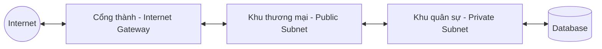
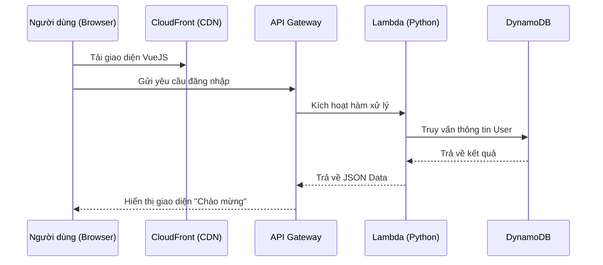
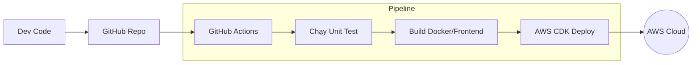

# ☁️ AWS ARCHITECTURE(MASTER CLASS)

Chào bạn! Đừng lo lắng nếu những thuật ngữ như "VPC" hay "Dijkstra" làm bạn thấy choáng ngợp. Tài liệu này sẽ giúp bạn xây dựng **Tư duy Kiến trúc Đám mây** từ con số 0 thông qua các ví dụ đời thực gần gũi nhất.

---

## 🏛️ PHẦN 0: TRIẾT LÝ VỀ ĐÁM MÂY (THE CLOUD PHILOSOPHY)

Để hiểu AWS, hãy tưởng tượng bạn đang xây dựng một **Thành phố (Dự án NexusFlow)**. Thay vì tự đi mua gạch, tự xây nhà máy điện (mua server vật lý), bạn thuê mọi thứ từ một **Siêu tập đoàn (AWS)**. Bạn chỉ cần trả tiền cho những gì bạn dùng nhât.

### Bản đồ Thành phố AWS (Mental Model)
*   **VPC:** Ranh giới thành phố của bạn.
*   **Subnet:** Các khu dân cư (Private) và khu thương mại (Public).
*   **IAM:** Bộ phận quản lý thẻ căn cước và quyền ra vào.
*   **EC2/Lambda:** Những người công nhân làm việc.
*   **S3/RDS:** Kho bãi lưu trữ hàng hóa và thư viện lưu dữ liệu.

---

## 📋 MỤC LỤC CHI TIẾT

1.  **[VPC (Mạng lưới): Xây dựng nền móng thành phố](#1-vpc-virtual-private-cloud-nen-mong-thanh-pho)**
2.  **[IAM (Bảo mật): Ai được vào thành phố?](#2-iam-ai-duoc-vao-thanh-pho)**
3.  **[Compute (Xử lý): Thuê nhân công EC2 hay Lambda?](#3-compute-nhan-cong-ec2-hay-lambda)**
4.  **[Storage (Lưu trữ): Kho bãi S3 và Thư viện RDS](#4-storage-kho-bai-s3-va-thu-vien-rds)**
5.  **[Messaging (Giao tiếp): Hệ thống bưu điện SQS/SNS](#5-messaging-he-thong-buu-dien-sqssns)**
6.  **[CDN (Tốc độ): Xây dựng cửa hàng ở mọi quốc gia](#6-cdn-cloudfront-xay-dung-cua-hang-toan-cau)**
7.  **[Infrastructure as Code (IaC): AWS CDK](#7-infrastructure-as-code-iac-aws-cdk)**
8.  **[AWS Toolbox: CLI & Boto3 (Python)](#8-bo-cong-cu-thuc-chien-aws-cli--boto3-python)**
9.  **[Communication Flow: Luồng dữ liệu](#9-co-che-giao-tiep-luong-du-lieu-communication-flow)**
10. **[Security Expert: Bảo mật tối thượng](#10-security-expert-bao-mat-toi-thuong)**
11. **[CI/CD Flow: Tự động hóa quy trình](#11-cicd-flow-tu-dong-hoa-quy-trinh)**
12. **[Well-Architected: 6 Cột trụ của hệ thống đỉnh cao](#12-well-architected-6-cot-tru-cua-he-thong-dinh-cao)**
13. **[Troubleshooting: Khi mọi thứ không chạy như ý](#13-troubleshooting-khi-moi-thu-khong-chay-nhu-y)**

---

## 🌐 1. VPC (Virtual Private Cloud): Nền móng Thành phố

### Định nghĩa đơn giản
VPC giống như một **"Lô đất riêng"** mà bạn thuê trong thành phố AWS khổng lồ. Không ai có thể vào đất của bạn nếu bạn không cho phép.

### Cách thành phố hoạt động (Workflow):


*   **Public Subnet:** Nơi bạn đặt cửa hàng (Frontend/Load Balancer) để mọi người có thể vào xem.
*   **Private Subnet:** Nơi bạn cất két sắt (Database), tuyệt đối không ai từ Internet được bước vào đây.
*   **Security Group:** Giống như **anh bảo vệ** đứng trước mỗi ngôi nhà, kiểm tra xem ai có "giấy mời" (IP/Port đúng) mới cho vào.

### 💡 Ví dụ thực tế (NexusFlow):
Dữ liệu nhạy cảm của khách hàng sẽ được cất trong một căn hầm (Private Subnet) và chỉ có nhân viên tin cậy (Backend API) trong cùng VPC mới có chìa khóa để vào.

---

## 🔐 2. IAM: Ai được vào thành phố?

### Định nghĩa đơn giản
IAM là hệ thống **Cấp thẻ nhân viên**. 

*   **Users:** Những người cụ thể (ví dụ: Bạn, Đồng nghiệp).
*   **Groups:** Các phòng ban (Phòng Dev, Phòng Kế toán).
*   **Roles:** Một cái "mũ" công việc. Ai đội mũ này thì được quyền đó (Sử dụng cho các ứng dụng tự động).
*   **Policies:** Các dòng chữ trên thẻ ghi: "Bạn được vào kho ảnh, nhưng không được vào két sắt".

### 💡 Ví dụ thực tế (NexusFlow):
Thay vì đưa chìa khóa tổng cho app, bạn đưa cho nó một cái thẻ (IAM Role) chỉ có quyền "Đọc file ảnh từ S3". Nếu lỡ app bị hack, hacker cũng không thể xóa database của bạn.

---

## 🚀 3. Compute: Nhân công EC2 hay Lambda?

Đây là nơi thực thi logic. Hãy chọn "nhân viên" phù hợp:

### A. EC2 (Máy chủ ảo) - "Nhân viên làm việc 24/7"
*   **Logic:** Bạn thuê một cái máy tính chạy ngày đêm. Bạn phải tự cài Windows/Linux, tự dọn dẹp.
*   **Khi nào dùng:** Khi ứng dụng của bạn luôn có người truy cập và cần cấu hình phức tạp.

### B. Lambda (Serverless) - "Người làm thuê theo giờ"
*   **Logic:** Bạn chỉ gọi họ khi cần. Xong việc họ sẽ biến mất. Bạn chỉ trả tiền cho 1-2 giây họ làm việc.
*   **Khi nào dùng:** Khi cần xử lý nhanh một việc (ví dụ: Gửi 1 email, đổi kích thước 1 tấm ảnh).

### 💡 Ví dụ thực tế (NexusFlow):
*   Sử dụng **ECS/Fargate** (nhân viên chuyên nghiệp) để chạy toàn bộ hệ thống API chính.
*   Sử dụng **Lambda** để gửi thông báo cho điện thoại người dùng khi có tin tức mới.

---

## 💾 4. Storage: Kho bãi S3 và Thư viện RDS

Dữ liệu cần nơi lưu trú an toàn:

### A. S3 (Simple Storage Service) - "Kho chứa hàng khổng lồ"
*   **Định nghĩa:** Nơi vứt file vào và nó sẽ không bao giờ mất (độ bền 99.999999999%).
*   **Ví dụ:** Lưu ảnh avtar, video hướng dẫn, log hệ thống.

### B. RDS (Relational Database Service) - "Thư viện hồ sơ"
*   **Định nghĩa:** Lưu dữ liệu có cấu trúc (bảng biểu, quan hệ). AWS sẽ tự động quét dọn và sắp xếp cho bạn.
*   **Ví dụ:** Lưu thông tin tài khoản người dùng, mật khẩu, đơn hàng.

---

## 📡 5. Messaging: Hệ thống bưu điện SQS/SNS

Khi thành phố quá đông đúc, các nhân viên cần gửi thư cho nhau thay vì nói chuyện trực tiếp (gây tắc nghẽn).

*   **SQS (Queue):** Giống như hòm thư. Thư cứ để đó, ai rảnh thì lấy ra đọc. Giúp hệ thống không bị sập khi quá tải.
*   **SNS (Notification):** Giống như cái loa phát thanh. Một người nói, tất cả các bộ phận liên quan đều nghe thấy.

---

## 🌍 6. CDN (CloudFront): Xây dựng cửa hàng toàn cầu

### Định nghĩa đơn giản
Nếu bạn có khách hàng ở Mỹ, thay vì bắt họ bay sang Việt Nam để xem website, bạn xây một **Cửa hàng ủy quyền (Edge Location)** ngay tại Mỹ.

### 💡 Ví dụ thực tế (NexusFlow):
Người dùng ở Hà Nội sẽ tải ảnh từ server Cache đặt tại Hà Nội. Người dùng ở Mỹ sẽ tải ảnh từ server Cache tại Mỹ. Mọi thứ diễn ra trong tích tắc!

---

## 🛠️ LỜI KHUYÊN CHO TAY MƠ (STARTER TIPS)

1.  **Đừng click bừa trên Console:** Hãy tập làm quen với **AWS Free Tier** (miễn phí 1 năm cho người mới).
2.  **Học IAM đầu tiên:** Luôn cài đặt Bảo mật 2 lớp (MFA) để tránh mất tiền triệu khi tài khoản bị hack.
3.  **Tư duy Cost Optimization:** Luôn hỏi "Dịch vụ này có tốn tiền không?" trước khi bật nó lên.
4.  **Gắn tag:** Luôn gắn nhãn cho tài nguyên (vd: `Project: NexusFlow`) để dễ quản lý tiền nhé!

---

## 🛠️ 8. BỘ CÔNG CỤ THỰC CHIẾN: AWS CLI & BOTO3 (PYTHON)

Để điều khiển thành phố AWS, bạn không chỉ dùng chuột click (Console), mà phải dùng "Bộ đàm" (CLI) hoặc "Mã lập trình" (SDK).

### A. AWS CLI (Command Line Interface)
Dùng để quản lý tài nguyên cực nhanh từ Terminal/CMD.

| Dịch vụ | Câu lệnh phổ biến | Ý nghĩa |
| :--- | :--- | :--- |
| **S3** | `aws s3 ls` | Liệt kê tất cả các Bucket. |
| **S3** | `aws s3 sync ./dist s3://my-bucket` | Đẩy code Frontend (dist) lên S3. |
| **Lambda** | `aws lambda list-functions` | Xem danh sách các hàm đang chạy. |
| **IAM** | `aws sts get-caller-identity` | Kiểm tra xem mình đang login bằng user nào. |
| **EC2** | `aws ec2 describe-instances` | Xem trạng thái các máy chủ ảo. |

### B. Python SDK (boto3) - Trái tim của NexusFlow
Trong Python, bạn dùng thư viện `boto3` để lập trình cho AWS:

```python
import boto3

# 1. Kết nối tới S3
s3 = boto3.client('s3')

# 2. Upload file báo cáo từ dự án NexusFlow lên AWS
s3.upload_file('report_2026.pdf', 'mynexus-bucket', 'reports/report_2026.pdf')
```

### C. Các thư viện Python bổ trợ (The Python-AWS Ecosystem)

| Thư viện | Mục đích chính | Khi nào nên dùng? |
| :--- | :--- | :--- |
| **AWS CDK** | Định nghĩa hạ tầng bằng code Python. | Khi muốn tạo nhanh 100 con Server tự động. |
| **AWS Powertools** | Tối ưu hóa cho Lambda (Log, Metrics, Tracing). | Khi viết code cho các hàm Lambda thực chiến. |
| **Mangum** | Cầu nối giữa FastAPI và AWS Lambda. | Khi muốn chạy dự án **FastAPI** trên Serverless. |
| **awswrangler** | Xử lý dữ liệu (Pandas) trên AWS. | Khi làm các báo cáo dữ liệu lớn cho NexusFlow. |
| **Chalice** | Framework micro-service cho Serverless. | Khi muốn viết nhanh một API nhỏ mà không cần setup nhiều. |

### D. Các hàm trọng tâm & Code mẫu (Key Functions)

Dưới đây là những hàm "phải biết" để bạn xây dựng dự án NexusFlow chuyên nghiệp:

#### 1. AWS Powertools (Viết Lambda chuyên nghiệp)
```python
from aws_lambda_powertools import Logger, Tracer

logger = Logger()
tracer = Tracer()

@tracer.capture_lambda_handler
@logger.inject_lambda_context
def lambda_handler(event, context):
    logger.info("Dữ liệu đang được xử lý trong Lambda!")
    return {"status": "success"}
```

#### 2. Mangum (Đưa FastAPI lên Lambda)
```python
from fastapi import FastAPI
from mangum import Mangum

app = FastAPI()
handler = Mangum(app) # Hàm handler này sẽ được đặt làm Lambda entry point
```

#### 3. Data Wrangler (Xử lý dữ liệu cực nhanh)
```python
import awswrangler as wr
import pandas as pd

# Đọc file CSV khổng lồ từ S3 chỉ bằng 1 dòng
df = wr.s3.read_csv("s3://nexus-bucket/market_data.csv")

# Ghi dữ liệu ra định dạng Parquet (tối ưu tốc độ/chi phí hơn CSV)
wr.s3.to_parquet(df, path="s3://nexus-bucket/processed_data/")
```

#### 4. AWS CDK (Tạo hạ tầng bằng Python)
```python
from aws_cdk import aws_s3 as s3, Stack

class NexusInfrastructure(Stack):
    def __init__(self, scope, id, **kwargs):
        super().__init__(scope, id, **kwargs)
        # Tạo 1 cái xô (Bucket) lưu ảnh với Versioning tự động
        s3.Bucket(self, "NexusAssets", versioned=True)
```

---

## 🔗 9. CƠ CHẾ GIAO TIẾP: LUỒNG DỮ LIỆU (COMMUNICATION FLOW)

Làm sao các phần "nói chuyện" được với nhau an toàn?

### Luồng "Bắt tay" tiêu chuẩn (The Handshake):
1.  **Người dùng** gửi yêu cầu từ Browser (VueJS).
2.  **API Gateway** nhận yêu cầu, kiểm tra thẻ (API Key/Token).
3.  **Lambda** (Python) thức dậy, xử lý logic, đọc dữ liệu từ **RDS**.
4.  **S3** trả về file ảnh (nếu cần).
5.  Dữ liệu quay ngược lại người dùng.

### Sơ đồ giao tiếp kỹ thuật:


### 💡 Lưu ý quan trọng về Giao tiếp:
*   **Synchronous (Đồng bộ):** User đợi kết quả ngay lập tức (API Gateway -> Lambda).
*   **Asynchronous (Bất đồng bộ):** User gửi yêu cầu rồi đi làm việc khác, kết quả trả về sau (SQS -> SNS).

---

## 🔐 10. SECURITY EXPERT: BẢO MẬT TỐI THƯỢNG

Ở trình độ Expert, "Chạy được" là chưa đủ, phải là **"Chạy an toàn"**.

### A. AWS Secrets Manager - "Chiếc két sắt giấu tên"
**Vấn đề:** 90% người mới sẽ viết cứng mật khẩu `db_password = '123456'` vào code Python. Đây là thảm họa bảo mật!
**Giải pháp:** Lưu mật khẩu vào AWS Secrets Manager. Khi chạy, Lambda sẽ gọi `boto3` lấy mật khẩu về dùng.

```python
# Cách lấy mật khẩu an toàn
import boto3
secret_name = "nexus/db/password"
client = boto3.client(service_name='secretsmanager')
get_secret_value_response = client.get_secret_value(SecretId=secret_name)
```

### B. AWS WAF (Web Application Firewall)
**Vấn đề:** Các cuộc tấn công như SQL Injection, Cross-site Scripting (XSS).
**Giải pháp:** Đặt WAF đứng trước CloudFront/ALB để lọc sạch các request "nham hiểm" trước khi chúng đến được Server của bạn.

---

## 🏗️ 11. CI/CD FLOW: TỰ ĐỘNG HÓA QUY TRÌNH

Đừng bao giờ deploy code bằng tay. Hãy xây dựng một **"Nhà máy tự động"**.

### Quy trình CI/CD tiêu chuẩn cho NexusFlow:
1.  **Code:** Bạn viết code trên máy cá nhân.
2.  **Commit & Push:** Đẩy code lên **GitHub**.
3.  **CI (Continuous Integration):** 
    *   GitHub Actions tự động chạy **Pytest** để kiểm tra lỗi.
    *   Tự động quét bảo mật code.
4.  **CD (Continuous Deployment):** 
    *   Nếu code ok, GitHub Actions gọi `cdk deploy` đẩy hạ tầng lên AWS.
    *   Người dùng có ngay phiên bản website mới sau 2 phút.

### Sơ đồ luồng tự động:


---

## 🏗️ 12. WELL-ARCHITECTED: 6 CỘT TRỤ CỦA HỆ THỐNG ĐỈNH CAO

Để trở thành một Architect thực thụ, bạn không được thiết kế "theo bản năng", mà phải bám sát 6 cột trụ của AWS:

1.  **Operational Excellence (Vận hành xuất sắc):** Mọi thứ phải được tự động hóa (IaC) và có thể quan sát được (Monitoring).
2.  **Security (Bảo mật):** Áp dụng bảo mật đa lớp (Defense in Depth) và quyền tối thiểu (Least Privilege).
3.  **Reliability (Độ tin cậy):** Hệ thống phải có khả năng tự phục hồi (Self-healing) khi có sự cố.
4.  **Performance Efficiency (Hiệu suất):** Chọn đúng loại server (Instance Type) và xử lý dữ liệu ở nơi gần người dùng nhất (CDN).
5.  **Cost Optimization (Tối ưu chi phí):** Không trả tiền cho những tài nguyên không dùng đến (như tắt server dev vào cuối tuần).
6.  **Sustainability (Bền vững):** Giảm thiểu tác động môi trường bằng cách tối ưu hóa việc tiêu thụ năng lượng của server.

---

## 🛠️ 13. TROUBLESHOOTING: KHI MỌI THỨ KHÔNG CHẠY NHƯ Ý

Kiến trúc sư giỏi là người biết "bắt bệnh" nhanh nhất khi hệ thống gặp sự cố:

| Triệu chứng | Kiểm tra ngay | Logic "bắt bệnh" |
| :--- | :--- | :--- |
| **Timeout (408/504)** | Security Group / NACL | Kiểm tra xem cổng (Port) đã được mở chưa? |
| **Access Denied (403)** | IAM Policy | User/Role có quyền thực hiện hành động đó không? |
| **Database Connection Error** | VPC / Subnet | Database và App có nằm chung VPC? Có bị chặn bởi Tường lửa không? |
| **Website chạy cực chậm** | CloudWatch / X-Ray | Xem bước nào trong "Luồng giao tiếp" đang bị tắc nghẽn (Lambda xử lý lâu or DB chậm)? |
| **Lỗi 5xx (Server Error)** | CloudWatch Logs | Đọc log của ứng dụng để tìm nguyên nhân cụ thể (Exception trong Python). |

### 💡 Tuyệt chiêu "Bắt mạch" chuyên sâu: AWS X-Ray
Dùng X-Ray để tạo ra một **Service Map** trực quan. Bạn sẽ thấy dữ liệu đi từ API Gateway mất bao nhiêu ms, đến Lambda mất bao lâu... Từ đó tìm ra chính xác "con sâu làm rầu nồi canh".

---

## 🏁 KẾT LUẬN: HÀNH TRÌNH KHÔNG ĐIỂM DỪNG
Đến đây, bạn đã đi từ một **"Tay mơ"** hiểu về Cloud qua phép ẩn dụ thành phố, đến một **"Cấp độ Associate"** biết dùng CLI/Boto3, và kết thúc ở một **"Kiến trúc sư"** nắm giữ các cột trụ của hệ thống.

*Thành phố AWS của bạn không bao giờ đứng yên, nó sẽ luôn được nâng cấp. Chúc bạn thành công với dự án NexusFlow!*
