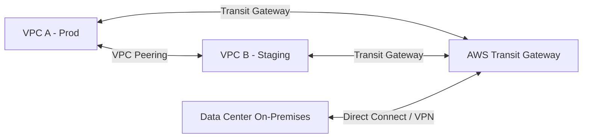
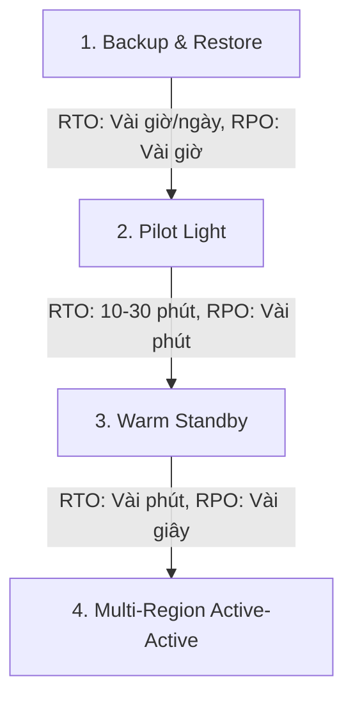

# ☁️ CẨM NANG TOÀN DIỆN VỀ AMAZON WEB SERVICES (AWS KNOWLEDGE HANDBOOK)

> **Tài liệu tổng hợp và đào sâu kiến thức AWS chuyên sâu từ các nguồn uy tín (Awesome AWS, OG-AWS, AWS Certification Resources, AWS DevOps Zero to Hero).**  
> **Mục tiêu:** Giúp lập trình viên / DevOps Engineer / Cloud Architect nắm vững bản chất kỹ thuật, các pattern vận hành hệ thống thực tế trên đám mây, làm chủ kỹ năng xử lý sự cố (Troubleshooting) và sẵn sàng cho các chứng chỉ AWS (Cloud Practitioner, Solutions Architect, DevOps Engineer).

---

## 📌 MỤC LỤC
1. [Khái Niệm Nền Tảng về Cloud & Hạ Tầng Toàn Cầu](#1-khái-niệm-nền-tảng-về-cloud--hạ-tầng-toàn-cầu)
2. [Quản Lý Định Danh, Mã Hóa & Bảo Mật Chuyên Sâu (IAM, STS, KMS, Organizations)](#2-quản-lý-định-danh-mã-hóa--bảo-mật-chuyên-sâu-iam-sts-kms-organizations)
3. [Dịch Vụ Tính Toán, Đĩa Cứng & Containers (EC2, EBS, Placement Groups, ECS, EKS)](#3-dịch-vụ-tính-toán-đĩa-cứng--containers-ec2-ebs-placement-groups-ecs-eks)
4. [Mạng Đám Mây & Hạ Tầng Mạng Chuyên Sâu (VPC, Peering, Transit Gateway, Direct Connect, Flow Logs)](#4-mạng-đám-mây--hạ-tầng-mạng-chuyên-sâu-vpc-peering-transit-gateway-direct-connect-flow-logs)
5. [Dịch Vụ Lưu Trữ & Phân Phối Dữ Liệu Chi Tiết (S3, EFS, CloudFront, Edge Functions)](#5-dịch-vụ-lưu-trữ--phân-phối-dữ-liệu-chi-tiết-s3-efs-cloudfront-edge-functions)
6. [Cơ Sở Dữ Liệu & Bộ Đệm trên AWS (RDS, Aurora, DynamoDB & ElastiCache)](#6-cơ-sở-dữ-liệu--bộ-đệm-trên-aws-rds-aurora-dynamodb--elasticache)
7. [AWS DevOps, Serverless Messaging & Event-Driven (IaC, SQS, SNS, EventBridge, Step Functions)](#7-aws-devops-serverless-messaging--event-driven-iac-sqs-sns-eventbridge-step-functions)
8. [Giám Sát, Bảo Mật Nâng Cao & Quản Trị (CloudWatch, CloudTrail, SSM, WAF, GuardDuty, Macie, Control Tower)](#8-giám-sát-bảo-mật-nâng-cao--quản-trị-cloudwatch-cloudtrail-ssm-waf-guardduty-macie-control-tower)
9. [Chiến Lược Khắc Phục Sự Cố (Disaster Recovery) & Mô Hình Event-Driven](#9-chiến-lược-khắc-phục-sự-cố-disaster-recovery--mô-hình-event-driven)
10. [Ví Dụ Thực Chiến Mã Nguồn với AWS CLI & Python Boto3](#10-ví-dụ-thực-chiến-mã-nguồn-với-aws-cli--python-boto3)
11. [Bộ Khung Kiến Trúc Đỉnh Cao (AWS Well-Architected Framework)](#11-bộ-khung-kiến-trúc-đỉnh-cao-aws-well-architected-framework)
12. [Lưu Ý Quan Trọng & Bẫy Vận Hành Thực Tế (Gotchas & Best Practices)](#12-lưu-ý-quan-trọng--bẫy-vận-hành-thực-tế-gotchas--best-practices)
13. [Hướng Dẫn Xử Lý Sự Cố & Các Vấn Đề Thực Tế trong Vận Hành (Expert Troubleshooting & Production Pitfalls)](#13-hướng-dẫn-xử-lý-sự-cố--các-vấn-đề-thực-tế-trong-vận-hành-expert-troubleshooting--production-pitfalls)
14. [Kiến Trúc Phân Tích Dữ Liệu & AI/ML trên AWS (Big Data, Analytics & Gen-AI)](#14-kiến-trúc-phân-tích-dữ-liệu--aiml-trên-aws-big-data-analytics--gen-ai)
15. [Giải Thích Bản Chất Logic Các Cơ Chế Vận Hành AWS (Deep Underlying Logic & Architectural Mechanics)](#15-giải-thích-bản-chất-logic-các-cơ-chế-vận-hành-aws-deep-underlying-logic--architectural-mechanics)
16. [Bản Đồ Áp Dụng Thực Tế Theo Vị Trí Công Việc & Kịch Bản Dự Án (Practical Application Map by Job Roles & Project Use-Cases)](#16-bản-đồ-áp-dụng-thực-tế-theo-vị-trí-công-việc--kịch-bản-dự-án-practical-application-map-by-job-roles--project-use-cases)
17. [Thực Hành Labs & Bộ Tài Liệu Ôn Thi Chứng Chỉ AWS Tự Học (Self-Contained AWS Labs & Certification Study System)](#17-thực-hành-labs--bộ-tài-liệu-ôn-thi-chứng-chỉ-aws-tự-học-self-contained-aws-labs--certification-study-system)

---

## 1. KHÁI NIỆM NỀN TẢNG VỀ CLOUD & HẠ TẦNG TOÀN CẦU

### 1.1 Các mô hình Cloud Computing
- **Public Cloud:** Hạ tầng thuộc sở hữu của nhà cung cấp bên thứ ba (AWS, GCP, Azure), chia sẻ tài nguyên ảo hóa đa người dùng (Multi-tenant). Trả tiền theo lượng tiêu thụ (Pay-as-you-go).
- **Private Cloud:** Hạ tầng đám mây xây dựng riêng cho 1 tổ chức (Single-tenant), thường triển khai On-Premises sử dụng OpenStack hoặc VMware.
- **Hybrid Cloud:** Mô hình kết hợp giữa On-Premises và Public Cloud qua kênh kết nối bảo mật (IPsec VPN hoặc AWS Direct Connect).

### 1.2 Thành phần Hạ tầng Toàn cầu của AWS (Global Infrastructure)
- **Regions (Vùng địa lý):** Khu vực địa lý vật lý riêng biệt trên toàn cầu (ví dụ: `us-east-1` N. Virginia, `ap-southeast-1` Singapore). Các Region hoàn toàn độc lập với nhau.
- **Availability Zones (AZs - Vùng sẵn sàng):** Mỗi Region chứa tối thiểu 3 AZs. Mỗi AZ gồm một hoặc nhiều Trung tâm Dữ liệu (Data Centers) riêng biệt về nguồn điện, hệ thống làm mát và kết nối mạng. Độ trễ giữa các AZ trong cùng 1 Region cực thấp (< 1-2 ms).
- **Edge Locations / Points of Presence (PoP):** Hàng trăm điểm biên trên khắp thế giới phục vụ phân phối nội dung tĩnh/động (CloudFront CDN) và phân giải tên miền tốc độ cao (Route 53).
- **Local Zones & Wavelength:** Mở rộng hạ tầng AWS tới gần các trung tâm đô thị lớn hoặc trạm thu phát 5G của nhà mạng viễn thông để đạt độ trễ siêu thấp (single-digit millisecond).

---

## 2. QUẢN LÝ ĐỊNH DANH, MÃ HÓA & BẢO MẬT CHUYÊN SÂU (IAM, STS, KMS, ORGANIZATIONS)

### 2.1 IAM & STS (Security Token Service)
- **Root User:** Tài khoản khởi tạo ban đầu. **Bắt buộc:** Khóa tài khoản bằng Hardware MFA, xóa Access Key và tuyệt đối không dùng trong công việc lập trình/quản trị hàng ngày.
- **IAM Policies (JSON Structure):**
  - **Version:** Luôn sử dụng `"Version": "2012-10-17"`.
  - **Statement:** Mảng chứa các câu lệnh quy định `Effect` (`Allow`/`Deny`), `Action` (`s3:GetObject`, `ec2:RunInstances`), `Resource` (ARN), và `Condition`.
- **Thứ tự Đánh giá IAM Policy:**
  1. **Explicit Deny:** Nếu có bất kỳ câu lệnh `Deny` nào khớp, yêu cầu bị **TỪ CHỐI NGAY LẬP TỨC**.
  2. **Explicit Allow:** Yêu cầu phải chứa ít nhất một câu lệnh `Allow` tương ứng mới được chấp thuận.
  3. **Implicit Deny:** Mặc định từ chối nếu không khớp với bất kỳ `Allow` nào.

### 2.2 IAM Conditions & Context Keys
Cho phép giới hạn quyền hạn dựa trên ngữ cảnh thực thi:
- `aws:PrincipalOrgID`: Chỉ cho phép người dùng thuộc một tổ chức trong **AWS Organizations**.
- `aws:SourceIp`: Chỉ cho phép gọi API từ dải IP văn phòng doanh nghiệp.
- `aws:SecureTransport`: Bắt buộc kết nối phải qua HTTPS/SSL (ví dụ: bắt buộc truyền S3 qua HTTPS).

### 2.3 Cross-Account Access & Confused Deputy Problem
- **sts:AssumeRole:** Cho phép tài khoản A đóng vai (Assume Role) một Role ở tài khoản B để truy cập tài nguyên tài khoản B mà không cần chia sẻ Access Key.
- **Confused Deputy Problem (Vấn đề đại lý bị nhầm lẫn):** Xảy ra khi một bên thứ ba (SaaS Vendor) thay mặt bạn truy cập tài nguyên AWS của bạn nhưng bị lợi dụng để truy cập tài nguyên của khách hàng khác.
- **Giải pháp:** Bắt buộc truyền `ExternalId` ngẫu nhiên độc nhất trong câu lệnh `sts:AssumeRole` khi làm việc với các dịch vụ bên thứ ba.

### 2.4 AWS KMS (Key Management Service) & Envelope Encryption
- **Mã hóa dữ liệu (Encryption at Rest):**
  - **SSE-S3:** AWS tự quản lý Master Key và Data Key.
  - **SSE-KMS:** Sử dụng khóa KMS do người dùng quản lý (KMS Key / CMK), hỗ trợ audit luồng truy cập qua CloudTrail.
  - **SSE-C:** Người dùng tự cung cấp khóa mã hóa riêng cho AWS mỗi lần upload.
- **Cơ chế Mã hóa Phong bì (Envelope Encryption):**
  1. KMS dùng **Customer Master Key (CMK)** để tạo ra một **Data Key** (gồm Plaintext Data Key và Encrypted Data Key).
  2. Ứng dụng dùng Plaintext Data Key để mã hóa dữ liệu lớn.
  3. Plaintext Data Key bị xóa khỏi bộ nhớ RAM ngay sau khi mã hóa xong.
  4. Encrypted Data Key được lưu trữ ngay bên cạnh dữ liệu đã mã hóa.

---

## 3. DỊCH VỤ TÍNH TOÁN, ĐĨA CỨNG & CONTAINERS (EC2, EBS, PLACEMENT GROUPS, ECS, EKS)

### 3.1 EC2 Instance Purchasing & Placement Strategies
- **Spot Instances & Spot Fleets:** Mua máy chủ thừa với giá rẻ đến 90%. AWS phát ra thông báo **Spot Interruption Warning trước 2 phút** qua Instance Metadata / EventBridge trước khi thu hồi.
- **EC2 Placement Groups (Chiến lược sắp xếp máy chủ vật lý):**
  - **Cluster:** Đặt các EC2 nằm chung trong 1 Rack vật lý trong cùng 1 AZ -> Băng thông siêu cao, độ trễ cực thấp (phù hợp HPC, Big Data, High-Performance Distributed DB).
  - **Partition:** Chia EC2 thành các cụm nằm ở các Rack phần cứng khác nhau -> Cách ly sự cố giữa các cụm (phù hợp HDFS, Cassandra, Kafka).
  - **Spread:** Mỗi EC2 nằm ở một Rack phần cứng hoàn toàn riêng biệt (tối đa 7 EC2/AZ) -> Giảm thiểu tối đa rủi ro hỏng hóc phần cứng cho máy chủ quan trọng.

### 3.2 Amazon EBS Volume Types (Ổ cứng Block Storage)

| Loại EBS Volume | Mã | Đối tượng sử dụng chính | IOPS tối đa | Throughput tối đa |
| :--- | :--- | :--- | :--- | :--- |
| **General Purpose SSD** | `gp3` | Web App, DB nhẹ, Dev/Test (Tùy chỉnh IOPS/Throughput độc lập) | 16,000 | 1,000 MB/s |
| **General Purpose SSD** | `gp2` | Hệ điều hành, ứng dụng mặc định (IOPS gắn liền với dung lượng đĩa) | 16,000 | 250 MB/s |
| **Provisioned IOPS SSD** | `io2 / io1` | CSDL quan trọng (Oracle, SQL Server, Postgres) cần IOPS cố định | 64,000 (io1) / 256,000 (io2 Block Express) | 4,000 MB/s |
| **Throughput Optimized HDD** | `st1` | Big Data, Data Warehousing, Log Processing (cần băng thông lớn) | 500 | 500 MB/s |
| **Cold HDD** | `sc1` | Dữ liệu lưu trữ ít truy cập, chi phí tối thiểu | 250 | 250 MB/s |

### 3.3 Containers trên AWS (ECS vs EKS)
- **Amazon ECS (Elastic Container Service):**
  - Dịch vụ điều phối container native nhẹ nhàng của AWS.
  - **Launch Types:**
    - `EC2 Launch Type`: Bạn tự quản lý cụm EC2 cluster bên dưới.
    - `AWS Fargate`: Serverless compute cho container, không cần quản lý EC2, trả tiền theo vCPU và RAM tiêu thụ của Task.
- **Amazon EKS (Elastic Kubernetes Service):**
  - Managed Kubernetes Service của AWS. Tự động quản lý Control Plane (Master Nodes) trên 3 AZs để đảm bảo High Availability.

---

## 4. MẠNG ĐÁM MÂY & HẠ TẦNG MẠNG CHUYÊN SÂU (VPC, PEERING, TRANSIT GATEWAY, DIRECT CONNECT, FLOW LOGS)

### 4.1 VPC Connectivity Options (Kết nối Mạng Doanh Nghiệp)



- **VPC Peering:**
  - Kết nối trực tiếp 2 VPC sử dụng hạ tầng mạng riêng của AWS.
  - **Tính chất:** Non-transitive (Không có tính bắc cầu). Nếu A peering với B, B peering với C -> A KHÔNG THỂ kết nối với C.
- **AWS Transit Gateway (TGW):**
  - Đóng vai trò như một Central Cloud Router kết nối hàng nghìn VPCs và On-Premises Networks theo mô hình Hub-and-Spoke. Hỗ trợ Transitive Routing.
- **AWS Direct Connect (DX):**
  - Đường truyền cáp quang vật lý riêng biệt từ Data Center On-Premises tới AWS Point of Presence (PoP) với băng thông 1Gbps / 10Gbps / 100Gbps, độ trễ ổn định và không qua Internet public.

### 4.2 VPC Flow Logs
- Tính năng ghi lại toàn bộ nhật ký lưu lượng IP đi vào/ra khỏi Elastic Network Interface (ENI) trong VPC.
- Giúp phát hiện các cuộc tấn công mạng, lỗ hổng cấu hình Security Group/NACL qua câu lệnh `ACCEPT` hoặc `REJECT`. Có thể đẩy log về CloudWatch Logs hoặc S3.

---

## 5. DỊCH VỤ LƯU TRỮ & PHÂN PHỐI DỮ LIỆU CHI TIẾT (S3, EFS, CLOUDFRONT, EDGE FUNCTIONS)

### 5.1 CloudFront CDN & Caching Mechanics
- **Cache Behaviors & Cache Keys:** Định nghĩa cách CloudFront xử lý các loại request khác nhau (ví dụ: `/*.jpg` cache 30 ngày, `/api/*` không cache).
- **Cache Invalidation:** Xóa bộ đệm tức thì tại các Edge Locations khi có cập nhật file (Ví dụ: `aws cloudfront create-invalidation --distribution-id XXX --paths "/*"`). Chi phí: 1000 đường dẫn invalidation đầu tiên mỗi tháng là miễn phí.

### 5.2 CloudFront Functions vs Lambda@Edge

| Tiêu chí | CloudFront Functions | Lambda@Edge |
| :--- | :--- | :--- |
| **Ngôn ngữ** | JavaScript (ES5.1 compliant) | Node.js, Python |
| **Vị trí thực thi** | 225+ Edge Locations | 30+ Regional Edge Caches |
| **Thời gian thực thi tối đa** | < 1 millisecond (Siêu nhanh) | 5 giây (Viewer triggers) / 30 giây (Origin triggers) |
| **Trường hợp sử dụng** | Header manipulation, URL rewrite/redirect, JWT verify đơn giản | A/B Testing phức tạp, User Auth với OAuth2, Image transformation |

---

## 6. CƠ SỞ DỮ LIỆU & BỘ ĐỆM TRÊN AWS (RDS, AURORA, DYNAMODB & ELASTICACHE)

### 6.1 DynamoDB Global Tables & Indexing
- **Global Tables:** Tự động nhân bản dữ liệu **Active-Active Multi-Region** đồng bộ với độ trễ dưới 1 giây. Phù hợp cho ứng dụng toàn cầu đòi hỏi đọc/ghi tại chỗ.
- **Secondary Indexes (Chỉ mục phụ):**
  - **Local Secondary Index (LSI):** Cùng Partition Key, khác Sort Key. Chỉ tạo được lúc khởi tạo Bảng ban đầu.
  - **Global Secondary Index (GSI):** Khác cả Partition Key lẫn Sort Key. Có thể tạo hoặc xóa bất kỳ lúc nào.

### 6.2 Chiến lược Caching với Amazon ElastiCache (Redis / Memcached)
- **Lazy Loading (Cache-Aside):**
  - Ứng dụng đọc từ Cache trước. Nếu Cache Miss -> Đọc từ DB -> Ghi dữ liệu đó vào Cache.
  - *Ưu điểm:* Cache chỉ chứa dữ liệu thực sự được yêu cầu. *Nhược điểm:* Độ trễ cao khi Cache Miss.
- **Write-Through:**
  - Ứng dụng luôn ghi dữ liệu vào Cache đồng thời với DB.
  - *Ưu điểm:* Dữ liệu trong Cache luôn tươi mới. *Nhược điểm:* Tốn dung lượng lưu trữ cho dữ liệu ít khi đọc tới.

---

## 7. AWS DEVOPS, SERVERLESS MESSAGING & EVENT-DRIVEN (IaC, SQS, SNS, EVENTBRIDGE, STEP FUNCTIONS)

### 7.1 CloudFormation & AWS CDK
- **Drift Detection:** Phát hiện sự sai lệch giữa cấu hình tài nguyên thực tế so với template CloudFormation gốc.
- **AWS CDK Constructs:** L1 (Cfn Constructs đại diện 1-1), L2 (Constructs với mặc định best practice), L3 (Solutions Constructs kết hợp nhiều dịch vụ).

### 7.2 Hệ thống Messaging Serverless (SQS & SNS)
- **Amazon SQS (Simple Queue Service):**
  - **Standard Queue:** Dung lượng nhắn tin không giới hạn, độ trễ cực thấp, đảm bảo tin nhắn được gửi **At-least-once (tối thiểu 1 lần)**, thứ tự tin nhắn có thể bị thay đổi.
  - **FIFO Queue:** Đảm bảo thứ tự **First-In-First-Out (Chính xác từng tin nhắn)** và **Exactly-once processing**. Giới hạn tối đa 300 msg/s (hoặc 3000 msg/s với batching). Yêu cầu truyền `MessageGroupId` và `MessageDeduplicationId`.
  - **Dead Letter Queue (DLQ):** Nơi chứa các message bị xử lý thất bại sau `maxReceiveCount` lượt thử lại để lập trình viên phân tích và sửa lỗi mà không làm nghẽn queue chính.
  - **Visibility Timeout:** Khoảng thời gian message bị ẩn đi sau khi 1 Consumer lấy về xử lý. Nếu Consumer chưa xóa message trước khi hết timeout, message sẽ xuất hiện lại cho Consumer khác lấy.
- **Amazon SNS (Simple Notification Service):**
  - Mô hình **Pub/Sub (Publish/Subscribe)**. Một Publisher gửi thông điệp tới SNS Topic, SNS sẽ tự động đẩy (Push) thông điệp đó tới hàng loạt Subscriptions (Email, SMS, Lambda, SQS, HTTP endpoints).
  - **Fanout Pattern:** Kết hợp SNS Topic trỏ tới nhiều SQS Queues song song để nhiều ứng dụng độc lập cùng xử lý 1 sự kiện mà không bị xung đột.

### 7.3 Event Bridge & AWS Step Functions
- **Amazon EventBridge:** Event Bus serverless giúp kết nối các sự kiện từ ứng dụng SaaS, AWS Services, và Custom Apps. Hỗ trợ **Schema Registry** và **Rule Content Filtering** giúp điều hướng sự kiện thông minh.
- **AWS Step Functions:** Dịch vụ Orchestration dưới dạng State Machine trực quan hóa workflows:
  - **Standard Workflows:** Dành cho quy trình dài (lên đến 1 năm), có lưu trữ lịch sử từng bước.
  - **Express Workflows:** Dành cho xử lý sự kiện tốc độ cao, độ trễ siêu thấp (lên đến 100,000 event/giây, tối đa 5 phút).

---

## 8. GIÁM SÁT, BẢO MẬT NÂNG CAO & QUẢN TRỊ (CLOUDWATCH, CLOUDTRAIL, SSM, WAF, GUARDDUTY, MACIE, CONTROL TOWER)

### 8.1 Parameter Store vs Secrets Manager

| Tiêu chí | AWS Systems Manager Parameter Store | AWS Secrets Manager |
| :--- | :--- | :--- |
| **Mục đích** | Lưu giữ tham số cấu hình tĩnh & chuỗi mã hóa (Plaintext/SecureString) | Lưu giữ thông tin mật khẩu DB, API Keys với tính năng tự động xoay vòng (Auto-rotation) |
| **Xoay mật khẩu (Rotation)** | Không tự động xoay vòng (Phải tự viết Lambda) | Hỗ trợ xoay mật khẩu tự động tích hợp sẵn với RDS, Redshift, DocumentDB qua Lambda |
| **Chi phí** | Standard Parameters miễn phí | Tốn phí hàng tháng cho mỗi Secret + phí API calls |

### 8.2 Bảo mật Nâng cao & Threat Detection
- **AWS WAF (Web Application Firewall):**
  - Bảo vệ Web App khỏi các cuộc tấn công tầng ứng dụng (Layer 7) như SQL Injection, Cross-Site Scripting (XSS), HTTP Flood (Rate-based rules). Gắn trực tiếp vào CloudFront, ALB, API Gateway.
- **AWS Shield:**
  - **Shield Standard:** Miễn phí cho toàn bộ khách hàng AWS, bảo vệ chống các cuộc tấn công DDoS ở Tầng 3 và Tầng 4 (SYN Floods, UDP Floods).
  - **Shield Advanced:** Trả phí nâng cao, hỗ trợ bảo vệ DDoS Tầng 7, bồi thường chi phí tài nguyên tăng đột biến do DDoS và kết nối trực tiếp với Đội ứng cứu sự cố 24/7 (DRT Team).
- **Amazon GuardDuty:**
  - Dịch vụ phát hiện đe dọa an ninh thông minh dựa trên Machine Learning. Phân tích liên tục VPC Flow Logs, CloudTrail Logs, DNS Logs, EKS Audit Logs để phát hiện EC2 bị chiếm quyền điều khiển (Crypto Mining) hoặc lộ credential.
- **Amazon Macie:**
  - Sử dụng AI/ML để tự động quét và phân loại các dữ liệu nhạy cảm (PII - Thông tin cá nhân, Số thẻ tín dụng, SSN) lưu trữ trên các S3 Buckets.
- **AWS Control Tower & Landing Zone:**
  - Thiết lập hạ tầng đa tài khoản (Multi-Account) theo chuẩn doanh nghiệp tự động với các rào chắn bảo mật (**Guardrails**) bắt buộc tuân thủ.

---

## 9. CHIẾN LƯỢC KHÁC PHỤC SỰ CỐ (DISASTER RECOVERY) & MÔ HÌNH EVENT-DRIVEN

### 9.1 Khái niệm RTO và RPO trong Khắc phục Sự cố
- **RTO (Recovery Time Objective):** Thời gian tối đa hệ thống cho phép bị ngừng hoạt động (Downtime) sau sự cố.
- **RPO (Recovery Point Objective):** Lượng dữ liệu tối đa hệ thống cho phép bị mất (tính theo thời gian kể từ bản backup gần nhất).



1. **Backup & Restore (RTO/RPO cao nhất, Chi phí rẻ nhất):** Backup dữ liệu định kỳ sang S3/Glacier Region khác. Khi sự cố xảy ra, dựng lại hạ tầng từ CloudFormation/CDK và restore DB.
2. **Pilot Light:** Dữ liệu DB được nhân bản liên tục sang Region phụ. Các dịch vụ máy chủ core chỉ duy trì ở dạng nhỏ gọn tối thiểu (minimal footprint).
3. **Warm Standby:** Dựng sẵn phiên bản thu nhỏ (scaled-down version) của toàn bộ hệ thống chạy 24/7 ở Region phụ. Khi Region chính sập, mở rộng quy mô (Scale out) hệ thống phụ lên 100%.
4. **Multi-Region Active-Active (RTO/RPO gần bằng 0, Chi phí đắt nhất):** Xây dựng hệ thống phục vụ lưu lượng đồng thời ở cả 2 Region sử dụng Route 53 Geolocation Routing và DynamoDB Global Tables / Aurora Global Database.

---

## 10. VÍ DỤ THỰC CHIẾN MÃ NGUỒN VỚI AWS CLI & PYTHON BOTO3

### 10.1 Thực hành lệnh AWS CLI hay dùng
```bash
# 1. Liệt kê toàn bộ S3 Buckets
aws s3 ls

# 2. Upload thư mục local lên S3 với chế độ sync đa luồng
aws s3 sync ./dist s3://my-app-static-bucket --delete

# 3. Lấy IP Public của Instance EC2 theo Name tag
aws ec2 describe-instances \
  --filters "Name=tag:Name,Values=MyWebServer" \
  --query "Reservations[*].Instances[*].[InstanceId, PublicIpAddress, State.Name]" \
  --output table

# 4. Kiểm tra lịch sử gọi API trên CloudTrail
aws cloudtrail lookup-events --lookup-attributes AttributeKey=EventName,AttributeValue=RunInstances
```

### 10.2 Đoạn mã Python Boto3 kết nối S3 & Secrets Manager
```python
import boto3
import json
from botocore.exceptions import ClientError

def get_secret(secret_name: str, region_name: str = "ap-southeast-1") -> dict:
    """Lấy thông tin Secret bảo mật từ AWS Secrets Manager"""
    session = boto3.session.Session()
    client = session.client(service_name="secretsmanager", region_name=region_name)

    try:
        get_secret_value_response = client.get_secret_value(SecretId=secret_name)
    except ClientError as e:
        raise e

    secret = get_secret_value_response["SecretString"]
    return json.loads(secret)

def upload_file_to_s3(file_path: str, bucket_name: str, object_key: str):
    """Upload tệp lên S3 với Server-Side Encryption (SSE-S3)"""
    s3_client = boto3.client("s3")
    s3_client.upload_file(
        Filename=file_path,
        Bucket=bucket_name,
        Key=object_key,
        ExtraArgs={"ServerSideEncryption": "AES256"}
    )
    print(f"Upload thành công {file_path} -> s3://{bucket_name}/{object_key}")
```

---

## 11. BỘ KHUNG KIẾN TRÚC ĐỈNH CAO (AWS WELL-ARCHITECTED FRAMEWORK)

Bộ khung chuẩn mực gồm **6 Cột trụ (6 Pillars)** giúp thiết kế hệ thống vững chắc:

1. **Operational Excellence (Vận hành xuất sắc):** Thực hiện thay đổi dưới dạng mã (IaC), dự đoán thất bại, phản ứng tự động với các sự cố.
2. **Security (Bảo mật):** Phân quyền tối thiểu (Least Privilege), mã hóa mọi nơi (In-Transit & At-Rest), tự động hóa kiểm tra an ninh.
3. **Reliability (Độ tin cậy):** Tự động phục hồi sau lỗi (Self-healing), thử nghiệm quy trình khôi phục sự cố khẩn cấp (Chaos Engineering).
4. **Performance Efficiency (Tối ưu hiệu năng):** Sử dụng các kiến trúc Serverless, Caching & Global Edge Locations.
5. **Cost Optimization (Tối ưu chi phí):** Loại bỏ tài nguyên nhàn rỗi, đo lường chỉ số hiệu quả kinh tế (ROI), dùng Savings Plans/Spot Instances.
6. **Sustainability (Tính bền vững):** Tối ưu hóa việc tiêu thụ năng lượng và hạ tầng vật lý của trung tâm dữ liệu đám mây.

---

## 12. LƯU Ý QUAN TRỌNG & BẪY VẬN HÀNH THỰC TẾ (GOTCHAS & BEST PRACTICES)

1. ❗ **Bảo mật Access Key:** Không commit file chìa khóa AWS lên Git. Sử dụng IAM Roles cho EC2/Lambda thay vì ghi đè Access Key.
2. ❗ **Bẫy NAT Gateway & ALB:** Chi phí NAT Gateway tính theo từng giờ + dung lượng data đi qua. Ở môi trường Dev, hãy cân nhắc dùng NAT Instance nhỏ hoặc xóa khi không làm việc.
3. ❗ **Mất dữ liệu Instance Store:** Dữ liệu trên đĩa Instance Store của EC2 sẽ mất hoàn toàn khi Instance bị `STOP` hoặc `TERMINATE`. Bắt buộc dùng EBS nếu muốn bảo toàn dữ liệu.
4. ❗ **Chi phí Log retention CloudWatch:** Mặc định CloudWatch Logs giữ log **vĩnh viễn (Never Expire)**. Hãy đặt Retention Policy (vd: 14 ngày hoặc 30 ngày) để tránh trả chi phí lưu trữ log khổng lồ.

---

## 13. HƯỚNG DẪN XỬ LÝ SỰ CỐ & CÁC VẤN ĐỀ THỰC TẾ TRONG VẬN HÀNH (EXPERT TROUBLESHOOTING & PRODUCTION PITFALLS)

### 13.1 Sự cố Kết nối EC2 qua SSH / Network Timeout
- **Sự cố `Connection timed out`:**
  - *Nguyên nhân:* Cổng 22 chưa được cho phép ở Security Group; NACL chặn Inbound/Outbound ephemeral ports; Subnet thiếu Route `0.0.0.0/0` trỏ tới Internet Gateway (IGW); hoặc Instance bị thiếu Public IP.
  - *Cách khắc phục:* Kiểm tra Security Group -> Route Table của Subnet -> NACL -> IGW.
- **Sự cố `Permission denied (publickey)`:**
  - *Nguyên nhân:* Phân quyền file private key `.pem` quá lỏng lẻo (bắt buộc dùng `chmod 400 key.pem`); gõ sai username mặc định của hệ điều hành (`ec2-user` cho Amazon Linux, `ubuntu` cho Ubuntu, `centos` cho CentOS, `admin` cho Debian); hoặc file `~/.ssh/authorized_keys` bị đổi quyền.
- *Khuyên dùng chuẩn Enterprise:* Loại bỏ hẳn SSH key và chuyển sang sử dụng **AWS Systems Manager (SSM) Session Manager** để truy cập shell an toàn không cần mở cổng 22 hay gán Public IP.

### 13.2 Sự cố S3 & CloudFront (Lỗi 403 Access Denied & CORS)
- **Lỗi `403 Access Denied` trên S3 Bucket:**
  - *Nguyên nhân:* Mâu thuẫn giữa 4 tầng phân quyền: S3 Block Public Access -> Bucket Policy -> IAM Policy -> Object ACL. Hoặc do Bucket mã hóa bằng KMS nhưng IAM User thiếu quyền `kms:Decrypt`.
  - *Cách xử lý:* Sử dụng **AWS IAM Policy Simulator** để kiểm tra chính xác câu lệnh `Allow`/`Deny` bị vướng.
- **Lỗi CORS trên Trình duyệt khi load tài nguyên từ CloudFront/S3:**
  - *Nguyên nhân:* S3 thiếu cấu hình CORS policy HOẶC CloudFront Cache Behavior chưa chuyển tiếp (forward) các HTTP Headers cần thiết (`Origin`, `Access-Control-Request-Headers`, `Access-Control-Request-Method`).
  - *Cách xử lý:* Thêm CORS Configuration vào S3 Bucket và tạo **Origin Request Policy** trên CloudFront để forward các CORS headers tới S3.

### 13.3 Sự cố CSDL RDS / Aurora (Cạn kiệt IOPS & Multi-AZ Failover Downtime)
- **Sự cố cạn kiệt Burst Credit IOPS đĩa `gp2`:**
  - *Hiện tượng:* Ứng dụng đột ngột phản hồi cực chậm, I/O latency tăng từ vài millisecond lên hàng trăm millisecond.
  - *Nguyên nhân:* Ổ đĩa `gp2` dùng hết Burst Balance do lượng đọc/ghi liên tục tăng cao.
  - *Cách xử lý:* Chuyển loại ổ đĩa từ `gp2` sang **`gp3`** (đảm bảo baseline 3,000 IOPS cố định không phụ thuộc dung lượng và không tốn Burst Credit) hoặc gán **`io1/io2`** Provisioned IOPS.
- **Sự cố Sập kết nối hàng loạt khi RDS Multi-AZ thực hiện Failover:**
  - *Nguyên nhân:* Lập trình viên thiết lập ứng dụng (Node.js, Java JVM) cache địa chỉ IP của DB quá lâu (DNS CNAME TTL quá lớn), khiến ứng dụng tiếp tục gửi traffic đến IP của DB cũ đã sập thay vì IP DB mới.
  - *Cách xử lý:* Đặt DNS TTL của ứng dụng nhỏ hơn 5 giây (`networkaddress.cache.ttl=5`) và triển khai **AWS RDS Proxy** để giữ kết nối mượt mà (Connection Pooling).

### 13.4 Sự cố DynamoDB Hot Partitions & Throttling
- **Lỗi `ProvisionedThroughputExceededException`:**
  - *Nguyên nhân:* Mặc dù tổng WCU/RCU chưa dùng hết, nhưng traffic bị tập trung 90% vào một **Partition Key đơn lẻ (Hot Key)** làm Partition đó bị quá tải cục bộ.
  - *Cách xử lý:* Thiết kế lại Partition Key có độ phân tán cao (High Cardinality), hoặc áp dụng thuật toán **Write Sharding / Salting** (gắn thêm suffix ngẫu nhiên `_1`, `_2` vào Partition Key) để dàn đều lưu lượng ra nhiều Partitions.

### 13.5 Sự cố Lambda Cold Starts & API Gateway 504 Timeouts
- **API Gateway báo lỗi `504 Gateway Timeout`:**
  - *Nguyên nhân:* API Gateway có thời hạn timeout cố định là **29 giây**. Nếu Lambda hoặc backend service xử lý mất quá 29s, API Gateway sẽ tự ngắt kết nối.
  - *Cách xử lý:* Không xử lý các tác vụ nặng (như export báo cáo, gửi email hàng loạt) một cách đồng bộ (Synchronous). Chuyển sang kiến trúc bất đồng bộ (Asynchronous): API Gateway nhận request -> đẩy vào SQS/EventBridge và trả về `202 Accepted` cho Client ngay -> Lambda/Fargate chạy ngầm bên dưới.

### 13.6 Các Bẫy Chi Phí Ẩn (Cloud Cost Traps)
- **Chi phí Data Transfer Out (DTO) giữa các AZs:** Lưu lượng dữ liệu truyền giữa 2 máy chủ EC2 nằm ở 2 AZs khác nhau trong cùng 1 Region bị tính phí **$0.01 / GB** cả 2 chiều.
  - *Giải pháp:* Cấu hình dịch vụ giao tiếp ưu tiên các máy chủ cùng AZ (Zone-Aware Routing).
- **Chi phí Log retention của CloudWatch Logs:** CloudWatch mặc định giữ nhật ký vĩnh viễn (`Never Expire`). Đối với hệ thống có dung lượng log gigabyte/ngày, sau vài tháng tiền lưu trữ log sẽ rất lớn.
  - *Giải pháp:* Luôn đặtRetention Policy cố định (vd: 7 ngày, 30 ngày) cho mọi Log Group.

---

## 14. KIẾN TRÚC PHÂN TÍCH DỮ LIỆU & AI/ML TRÊN AWS (BIG DATA, ANALYTICS & GEN-AI)

### 14.1 Phân tích Dữ liệu Lớn (Big Data & Analytics Engines)
- **Amazon Athena:**
  - Dịch vụ truy vấn SQL Serverless trực tiếp dữ liệu nằm trên S3 mà không cần load vào DB (Sử dụng Presto/Trino engine).
  - **Tối ưu chi phí:** Athena tính tiền $5 cho mỗi 1TB dữ liệu được quét (scanned). Bắt buộc lưu trữ file dữ liệu dưới định dạng nén cột (**Apache Parquet** hoặc **ORC**) và tạo **Partitioning** theo ngày/tháng để giảm lượng dữ liệu bị quét lên đến 90%.
- **Amazon Redshift:**
  - Dịch vụ Data Warehouse hiệu năng cao lưu trữ dữ liệu dạng cột (Columnar Storage).
  - **Distribution Keys:** Điều hướng phân bổ dữ liệu giữa các Compute Nodes: `EVEN` (chia đều), `KEY` (theo giá trị cột), `ALL` (copy toàn bộ bảng nhỏ sang mọi node).
  - **Redshift Spectrum:** Cho phép truy vấn trực tiếp hàng petabyte dữ liệu lưu trên S3 mà không cần load vào Redshift cluster.
- **Amazon Kinesis (Real-Time Data Streaming):**
  - **Kinesis Data Streams:** Thu thập và lưu giữ dữ liệu theo thời gian thực (1-365 ngày), chia nhỏ băng thông bằng các **Shards**.
  - **Kinesis Data Firehose:** Tự động nén, chuyển đổi định dạng và đẩy luồng dữ liệu liên tục vào S3, Redshift, hoặc OpenSearch (Near Real-Time).
- **AWS Glue:**
  - Dịch vụ Serverless Data Integration (ETL).
  - **Glue Crawlers & Data Catalog:** Tự động quét dữ liệu trên S3, RDS, DynamoDB để rút trích Schema và lưu trữ Metadata chung trong Data Catalog.

### 14.2 Nền tảng Trí tuệ Nhân tạo & AI Generative (AI/ML & Gen-AI)
- **Amazon SageMaker:**
  - Nền tảng Machine Learning toàn diện giúp xây dựng (Build), huấn luyện (Train), tối ưu (Tune) và triển khai (Deploy) các mô hình ML ở quy mô lớn.
- **Amazon Bedrock (Generative AI Serverless):**
  - Dịch vụ Serverless kết nối truy cập các mô hình nền tảng hàng đầu (Foundation Models - FMs) qua API (Claude, Llama, Titan, Stable Diffusion).
  - Hỗ trợ tính năng **RAG (Retrieval-Augmented Generation)** tích hợp dữ liệu nội bộ doanh nghiệp thông qua Bedrock Knowledge Bases mà không làm lộ dữ liệu ra mô hình bên ngoài.

---

## 15. GIẢI THÍCH BẢN CHẤT LOGIC CÁC CƠ CHẾ VẬN HÀNH AWS (DEEP UNDERLYING LOGIC & ARCHITECTURAL MECHANICS)

### 15.1 Logic Mạng & Định Tuyến Hạ Tầng
- **Tại sao Subnet Public và Private lại khác nhau dù nằm chung một VPC?**
  - *Logic:* Sự biệt duy nhất không nằm ở vị trí địa lý hay loại phần cứng đĩa, mà nằm hoàn toàn ở **Route Table** gắn kèm Subnet đó. Subnet nào có bảng đường đi trỏ `0.0.0.0/0 -> Internet Gateway (IGW)` thì được coi là Public Subnet. Subnet nào chỉ trỏ `0.0.0.0/0 -> NAT Gateway` hoặc không có tuyến đường ra Internet thì là Private Subnet.
- **Tại sao NAT Gateway bắt buộc phải đặt ở Public Subnet chứ không phải Private Subnet?**
  - *Logic:* NAT Gateway cần một địa chỉ IP Public (Elastic IP) và phải giao tiếp trực tiếp được với Internet Gateway (IGW). NAT Gateway đứng ra đóng vai trò đại lý thay thế IP (Source NAT): nhận request từ các EC2 Private Subnet, thay thế IP nguồn thành Public IP của NAT Gateway, gửi ra IGW, và sau đó chuyển dữ liệu trả về cho EC2 tương ứng trong Private Subnet.
- **Tại sao Security Group lại Stateful còn Network ACL (NACL) lại Stateless?**
  - *Logic:* Security Group hoạt động ở cấp độ card mạng ảo (ENI) trong Hypervisor máy chủ. Hypervisor duy trì một **Connection Tracking Table** (bảng theo dõi phiên kết nối). Khi gói tin được duyệt qua luồng vào (Inbound Allow), Hypervisor tự ghi nhớ session và tự động cấp phép cho luồng đáp trả đi ra mà không cần kiểm tra lại Outbound rules. Trái lại, NACL hoạt động ở tầng ranh giới Subnet như một Packet-Filter Router truyền thống không lưu vết phiên kết nối (Stateless), buộc bạn phải mở thủ công cổng trả về (Ephemeral Ports `1024-65535`) cho cả 2 chiều Inbound và Outbound.

### 15.2 Logic Lưu Trữ & Cơ Sở Dữ Liệu Phân Tán
- **Tại sao Amazon S3 đạt được độ bền 11 số 9 (99.999999999%)?**
  - *Logic:* Mỗi tệp upload lên S3 tự động được nhân bản đồng thời ra tối thiểu **3 Availability Zones (AZs) riêng biệt** trong cùng Region. Mỗi AZ là một trung tâm dữ liệu vật lý biệt lập cách nhau nhiều km. Xác suất toán học để cả 3 trung tâm dữ liệu vật lý độc lập cùng gặp sự cố phá hủy hoàn toàn tại cùng một giây là $1/10^{11}$.
- **Tại sao RDS Multi-AZ lại dùng Synchronous Replication còn Read Replica lại dùng Asynchronous Replication?**
  - *Logic:* Multi-AZ ưu tiên **Độ tin cậy tuyệt đối & Tính nhất quán (RPO = 0)** cho việc chống thiên tai (Disaster Recovery). Khi lệnh `COMMIT` được gọi ở Master DB, giao dịch chưa hoàn tất cho đến khi bản sao ở Standby AZ đã ghi nhận xong. Read Replica ưu tiên **Tốc độ ghi của Master DB (High Write Performance)**. Master DB trả về kết quả thành công cho ứng dụng ngay lập tức, sau đó luồng ghi log mới được đẩy bất đồng bộ sang các Read Replicas, chấp nhận có độ trễ nhỏ (*Replication Lag*).
- **Bản chất vấn đề Hot Partition trong DynamoDB là gì?**
  - *Logic:* DynamoDB sử dụng hàm băm mã hóa `MD5(Partition Key)` để quyết định ổ đĩa phần cứng vật lý nào lưu trữ dữ liệu. Mỗi Partition vật lý chịu giới hạn tối đa **1,000 WCU** và **3,000 RCU**. Nếu ứng dụng gửi 10,000 request/giây nhưng tất cả đều mang cùng 1 giá trị Partition Key (ví dụ: `ProductID = SaleItem1`), toàn bộ 10,000 request sẽ bị dồn vào đúng **1 Partition phần cứng duy nhất**, dẫn tới vượt ngưỡng 1,000 WCU và bị nổ lỗi Throttling, mặc dù tổng công suất toàn bảng đăng ký lên tới 50,000 WCU.

### 15.3 Logic Hệ Thống Phân Tán & Serverless
- **Tại sao SQS Standard Queue lại bị trùng lặp tin nhắn (At-least-once) và không đảm bảo thứ tự?**
  - *Logic:* Để đạt khả năng nhắn tin không giới hạn băng thông, SQS phân tán tin nhắn trên hàng nghìn cụm máy chủ vật lý. Khi Producer gửi message, SQS nhân bản nó ra nhiều máy chủ. Khi Consumer gọi `ReceiveMessage`, SQS truy vấn ngẫu nhiên một tập hợp các máy chủ để trả về kết quả nhanh nhất. Nếu kết nối mạng giữa Consumer và SQS bị gián đoạn đúng lúc Consumer gửi yêu cầu xóa (DeleteMessage), message đó chưa bị xóa hoàn toàn ở tất cả máy chủ vật lý và sẽ xuất hiện lại ở lần lấy sau -> Gây ra trùng lặp.
- **Bản chất đằng sau hiện tượng Lambda Cold Start là gì?**
  - *Logic:* Khi một request kích hoạt Lambda function mà chưa có sẵn Worker Container nào đang ở trạng thái rảnh (Warm Instance): AWS phải thực thi chuỗi hành động: *Cấp phát MicroVM (Firecracker Container) mới -> Tải gói mã nguồn của bạn từ S3 -> Khởi động môi trường Runtime (Python, Node.js, Java) -> Chạy mã nguồn nằm ngoài hàm handler (Init Phase)*. Toàn bộ thời gian chờ đợi chuỗi hành động này chính là Cold Start.
- **Tại sao lại phải dùng Envelope Encryption thay vì đưa trực tiếp dữ liệu cho KMS mã hóa?**
  - *Logic:* API dịch vụ KMS có giới hạn dung lượng payload mã hóa trực tiếp tối đa chỉ là **4KB**! Hơn nữa, việc truyền các file Gigabyte qua mạng internet lên server KMS để mã hóa rồi nhận file đã mã hóa về sẽ làm nghẽn băng thông và gây ra độ trễ (latency) khổng lồ. Với Envelope Encryption: KMS chỉ cần tạo ra một chìa khóa dữ liệu nhỏ (Plaintext Data Key < 1KB), ứng dụng dùng chìa khóa nhỏ này để mã hóa trực tiếp file lớn tại cục bộ RAM với tốc độ phần cứng AES-256 cực nhanh, sau đó xóa Plaintext Data Key khỏi RAM.

---

## 16. BẢN ĐỒ ÁP DỤNG THỰC TẾ THEO VỊ TRÍ CÔNG VIỆC & KỊCH BẢN DỰ ÁN (PRACTICAL APPLICATION MAP BY JOB ROLES & PROJECT USE-CASES)

### 16.1 Bản đồ Áp dụng Kiến thức theo Vị trí Công việc (By Job Roles)

#### 1. Cloud Solutions Architect / Enterprise Architect
- **Nhiệm vụ chính:** Thiết kế hạ tầng tổng thể, chọn lựa dịch vụ, đảm bảo tính sẵn sàng cao (HA), chống thiên tai (DR), và tối ưu chi phí doanh nghiệp.
- **Dịch vụ & Kiến thức áp dụng thực tế:**
  - Thiết kế mạng VPC đa tài khoản kết nối qua **Transit Gateway** & **Direct Connect**.
  - Xây dựng chiến lược **Disaster Recovery (Warm Standby / Active-Active)** theo chỉ số RTO/RPO.
  - Đánh giá kiến trúc dựa trên **6 Cột trụ của AWS Well-Architected Framework**.
  - Lựa chọn mô hình lưu trữ (EBS gp3 vs io2, S3 Intelligent-Tiering) và Database (RDS Multi-AZ vs Aurora Global DB).

#### 2. DevOps Engineer / SRE (Site Reliability Engineer)
- **Nhiệm vụ chính:** Tự động hóa hạ tầng (IaC), triển khai CI/CD, đóng gói container, vận hành hệ thống giám sát và bảo đảm Uptime (SLA).
- **Dịch vụ & Kiến thức áp dụng thực tế:**
  - Viết mã hạ tầng bằng **AWS CDK (TypeScript/Python)** hoặc **CloudFormation** (dùng Drift Detection).
  - Điều phối container với **Amazon ECS Fargate** hoặc **EKS**, quản lý image trên **ECR**.
  - Xây dựng pipeline tự động với **CodePipeline / CodeBuild / CodeDeploy**.
  - Thiết lập giám sát RAM/Disk bằng **CloudWatch Agent**, tạo Alarms kích hoạt **Auto Scaling Group**.
  - Quản lý truy cập shell bảo mật không dùng SSH key bằng **SSM Session Manager**.

#### 3. Backend Developer / Serverless Engineer
- **Nhiệm vụ chính:** Viết business logic, tích hợp các dịch vụ cloud qua SDKs (Python Boto3 / Node.js), thiết kế RESTful APIs & Event-Driven Microservices.
- **Dịch vụ & Kiến thức áp dụng thực tế:**
  - Viết hàm **AWS Lambda**, tạo API Gateway, điều phối workflow phức tạp bằng **Step Functions**.
  - Tích hợp hệ thống nhắn tin bất đồng bộ với **SQS FIFO**, **SNS Fanout Pattern**, và **EventBridge**.
  - Lưu trữ và truy vấn dữ liệu NoSQL tốc độ cao với **DynamoDB (Single-Table Design, GSI, Salting)**.
  - Lấy secret mật khẩu tự động với **Secrets Manager** và lưu trữ file an toàn qua **S3 Presigned URLs**.

#### 4. Data Engineer & Big Data Analyst
- **Nhiệm vụ chính:** Xây dựng Data Lake, luồng tích hợp dữ liệu (ETL), hạ tầng Data Warehouse và đường ống xử lý dữ liệu thời gian thực.
- **Dịch vụ & Kiến thức áp dụng thực tế:**
  - Xây dựng Data Lake lưu trữ file định dạng **Apache Parquet** phân chia **Partitioning** trên **Amazon S3**.
  - Truy vấn dữ liệu tức thì không cần máy chủ bằng **Amazon Athena**.
  - Thiết kế kho dữ liệu doanh nghiệp với **Amazon Redshift (Distribution Keys `EVEN`/`KEY`/`ALL`)**.
  - Xử lý luồng dữ liệu thời gian thực bằng **Kinesis Data Streams & Firehose**, tự động hóa ETL với **AWS Glue Crawlers**.

#### 5. Cloud Security Engineer & Compliance Officer
- **Nhiệm vụ chính:** Quản trị an ninh mạng, kiểm soát phân quyền (Access Control), mã hóa dữ liệu, đảm bảo tuân thủ tiêu chí PCI-DSS, ISO27001.
- **Dịch vụ & Kiến thức áp dụng thực tế:**
  - Phân quyền tối thiểu với **IAM Policies (Conditions: `aws:PrincipalOrgID`, `aws:SourceIp`)**.
  - Quản lý truy cập chéo tài khoản an toàn với **STS AssumeRole** & **ExternalId**.
  - Cấu hình tường lửa tầng 7 **AWS WAF**, bảo vệ DDoS với **AWS Shield Advanced**.
  - Theo dõi hành vi bất thường bằng **Amazon GuardDuty**, tự động quét thông tin PII lộ trên S3 với **Amazon Macie**.
  - Quản lý khóa mã hóa phong bì **KMS CMK** và bật kiểm toán **CloudTrail Log File Integrity**.

---

### 16.2 Bản đồ Áp dụng Kiến thức theo Kịch bản Dự án Thực tế (By Project Use-Cases)

#### 🛍️ Kịch bản 1: Hệ thống Web Thương Mại Điện Tử Scale Lớn (High-Traffic E-Commerce)
- **Thử thách:** Lượt truy cập tăng gấp 50 lần trong ngày Flash Sale, yêu cầu không sập CSDL, bảo mật thông tin thẻ ngân hàng.
- **Kiến trúc áp dụng:**
  - **Front-end:** Phân phối file Vue/React static từ **S3** qua **CloudFront CDN** (giảm 90% tải server).
  - **Back-end:** **ALB** điều hướng traffic vào **EC2 Auto Scaling Group** (tự động nhân bản server theo lượng CPU/Request).
  - **Caching:** Đặt **ElastiCache Redis (Strategy: Lazy Loading)** phía trước CSDL để cache sản phẩm hot.
  - **Database:** **Amazon Aurora MySQL (Multi-AZ + 3 Read Replicas)** đảm bảo chịu tải đọc và tự failover khi có sự cố.
  - **Thanh toán:** Đẩy đơn hàng vào **SQS FIFO Queue** để xử lý trừ tiền theo đúng thứ tự mà không bị nghẽn DB.

#### 📹 Kịch bản 2: Hệ thống Xử lý Video / Hình ảnh Tự động (Automated Media Pipeline)
- **Thử thách:** Khách hàng upload video hàng GB, cần tự động nén và sinh ra 5 độ phân giải (1080p, 720p, 480p...) mà không làm đơ máy chủ web chính.
- **Kiến trúc áp dụng:**
  - Web App gọi Lambda xin một **S3 Presigned URL** -> Client upload trực tiếp video lên **S3 Bucket (Incoming)**.
  - Sự kiện `s3:ObjectCreated` kích hoạt **EventBridge** -> Gọi **AWS Step Functions**.
  - Step Functions điều phối **AWS Fargate Task (Docker Container)** chạy ffmpeg để transcode video song song.
  - Kết quả lưu vào **S3 Bucket (Processed)** và gửi thông báo hoàn tất tới người dùng qua **SNS Email/Push Notification**.

#### 📊 Kịch bản 3: Data Lake & Phân tích Báo cáo Doanh nghiệp (Enterprise Data Analytics)
- **Thử thách:** Dữ liệu từ 100 chi nhánh cửa hàng đổ về liên tục (giao dịch, log ứng dụng), cần chạy báo cáo doanh thu theo giờ với chi phí thấp nhất.
- **Kiến trúc áp dụng:**
  - Các ứng dụng gửi log liên tục về **Amazon Kinesis Data Firehose**.
  - Firehose tự động chuyển đổi định dạng JSON thành **Apache Parquet**, nén lại và ghi lên **S3 Data Lake** theo cấu trúc thư mục `s3://data-lake/sales/year=2026/month=07/day=21/`.
  - **AWS Glue Crawler** quét S3 mỗi giờ để cập nhật Schema vào **Glue Data Catalog**.
  - Business Analyst sử dụng **Amazon Athena** gõ lệnh SQL trực tiếp truy vấn S3 (chỉ tốn vài cent cho mỗi lần query nhờ nén Parquet và Partitioning).

#### 🏢 Kịch bản 4: Chuyển đổi Hạ tầng On-Premises lên Cloud (Hybrid Cloud Migration)
- **Thử thách:** Doanh nghiệp có Data Center tại chỗ muốn kết nối an toàn với AWS, di chuyển CSDL hàng Terabyte lên mây mà không gây gián đoạn kinh doanh.
- **Kiến trúc áp dụng:**
  - Thiết lập đường cáp quang riêng **AWS Direct Connect** kết nối Data Center với **AWS Transit Gateway**.
  - Triển khai **AWS Database Migration Service (DMS)** nhân bản dữ liệu thời gian thực (CDC - Change Data Capture) từ On-Premises DB sang **Amazon RDS**.
  - Khi dữ liệu 2 bên hoàn toàn đồng bộ, sử dụng **Route 53 Weighted Routing** chuyển dần 10% -> 50% -> 100% traffic người dùng sang máy chủ AWS EC2.

---

## 17. THỰC HÀNH LABS & BỘ TÀI LIỆU ÔN THI CHỨNG CHỈ AWS TỰ HỌC (SELF-CONTAINED AWS LABS & CERTIFICATION STUDY SYSTEM)

### 17.1 Hướng dẫn Chi tiết 18 Bài Thực hành Thực chiến DevOps & Kết quả Nghiệm thu

#### 🔹 Lab 1: Khởi tạo & Bảo mật Tài khoản (Account Hardening)
- **Mục tiêu:** Bảo mật tuyệt đối tài khoản Root, thiết lập quản trị IAM và cảnh báo chi phí tự động.
- **Hướng dẫn thực hiện chi tiết & Giải thích bản chất:**
  1. Đăng nhập Root User -> Vào **IAM Console** -> Bật **Virtual MFA** (Google Authenticator / Authy).
     - *Bản chất kỹ thuật:* Root Account có quyền hạn tuyệt đối không thể bị chặn bởi bất kỳ IAM Policy nào. Nếu lộ password, hacker có thể xóa toàn bộ hạ tầng. MFA bắt buộc mã TOTP sinh ra từ thiết bị phần cứng để xác thực 2 bước.
     - *Lỗi thường gặp:* Quên lưu lại QR Code/Secret Key dự phòng. Nếu mất điện thoại sẽ gặp rất nhiều khó khăn trong quy trình xin khôi phục quyền Root từ hỗ trợ AWS.
  2. Tạo **IAM User Group** tên `Admins`, gán managed policy `AdministratorAccess`.
     - *Bản chất kỹ thuật:* Tuân thủ nguyên tắc Least Privilege và Phân tách trách nhiệm (Separation of Duties). Dùng IAM User riêng cho từng cá nhân để CloudTrail audit chính xác ai thực hiện thao tác nào.
  3. Tạo một **IAM User** thuộc nhóm `Admins`, ngắt kết nối Root User và không dùng Root User cho các tác vụ hàng ngày.
  4. Truy cập **AWS Billing & Cost Management** -> **Budgets** -> Tạo `Zero Spend Budget` và `Monthly Cost Budget` (ngưỡng $5). Nhập email nhận cảnh báo khi chi phí đạt 80% ($4).
     - *Bản chất kỹ thuật:* Tránh "bẫy vỡ nợ Cloud" do vô tình quên xóa các dịch vụ có chi phí duy trì theo giờ (NAT Gateway, Multi-AZ RDS, EKS cluster).
- **Kết quả nghiệm thu:**
  - Đăng nhập Root bắt buộc gõ mã OTP từ điện thoại.
  - Nhận email xác nhận đăng ký cảnh báo từ **AWS Budgets**.

#### 🔹 Lab 2: Quản lý Định danh & Phân quyền IAM (IAM Roles & Policies)
- **Mục tiêu:** Cấu hình phân quyền tối thiểu cho máy chủ EC2 đọc ghi S3 không dùng Access Key cố định.
- **Hướng dẫn thực hiện chi tiết & Giải thích bản chất:**
  1. Tạo S3 Bucket: `aws s3 mb s3://my-lab2-bucket-sec-check`.
  2. Tạo IAM Policy `S3ReadOnlyPolicy.json`:
     ```json
     {
       "Version": "2012-10-17",
       "Statement": [{
         "Effect": "Allow",
         "Action": ["s3:GetObject", "s3:ListBucket"],
         "Resource": ["arn:aws:s3:::my-lab2-bucket-sec-check", "arn:aws:s3:::my-lab2-bucket-sec-check/*"]
       }]
     }
     ```
     - *Giải thích JSON Policy:* Action `s3:ListBucket` bắt buộc gán cho ARN cấp Bucket (`arn:aws:s3:::bucket`), còn `s3:GetObject` bắt buộc gán cho ARN cấp Object (`arn:aws:s3:::bucket/*`). Nếu ghi thiếu đuôi `/*` sẽ gây lỗi Access Denied khi đọc file!
  3. Vào IAM Console -> **Roles** -> Tạo Role `EC2-S3-ReadOnly-Role` chọn Service `EC2`, đính kèm policy `S3ReadOnlyPolicy`.
  4. Gán Role này cho một EC2 Instance qua menu `Actions -> Security -> Modify IAM Role`.
     - *Bản chất kỹ thuật:* IAM Role cho EC2 sử dụng dịch vụ AWS STS để cấp credentials tạm thời (`ASIA...`) quay vòng mỗi vài giờ qua Instance Metadata Service (IMDSv2 `http://169.254.169.254`). Tuyệt đối không lưu Access Key cố định trong file code/server.
- **Kết quả nghiệm thu:**
  - Đứng từ EC2 chạy: `aws s3 ls s3://my-lab2-bucket-sec-check` -> **Thành công**.
  - Đứng từ EC2 chạy: `aws s3 cp file.txt s3://my-lab2-bucket-sec-check/` -> Bị chặn với lỗi `An error occurred (AccessDenied)`.

#### 🔹 Lab 3: Triển khai Ứng dụng Web tự động trên EC2 (User Data & SG)
- **Mục tiêu:** Tự động cài đặt Web Server khi khởi tạo EC2 bằng Script User Data và mở cổng mạng.
- **Hướng dẫn thực hiện chi tiết & Giải thích bản chất:**
  1. Vào EC2 Console -> **Launch Instance** (Amazon Linux 2023 / Ubuntu).
  2. Tạo Security Group `web-sg`: Mở Inbound Rule cổng 80 (HTTP) và 443 (HTTPS) từ `0.0.0.0/0`.
     - *Bản chất kỹ thuật:* Security Group hoạt động ở tầng Hypervisor ảo hóa (Stateful). Do đó chỉ cần mở Inbound cổng 80, gói tin HTTP response đi ra sẽ tự động được cho phép mà không cần mở Outbound rule thủ công.
  3. Tại mục **Advanced Details -> User Data**, dán đoạn script:
     ```bash
     #!/bin/bash
     yum update -y
     yum install -y httpd
     systemctl start httpd
     systemctl enable httpd
     echo "<h1>Hello from AWS EC2 Auto-Provisioned Web Server!</h1>" > /var/www/html/index.html
     ```
     - *Bản chất kỹ thuật:* User Data script chạy dưới quyền `root` duy nhất **một lần duy nhất** ở thời điểm boot máy chủ lần đầu tiên (First Boot).
     - *Lỗi thường gặp:* Thiếu `#!/bin/bash` làm cloud-init không nhận dạng được bash shell script.
  4. Khởi chạy Instance và lấy `Public IPv4 Address`.
- **Kết quả nghiệm thu:**
  - Dán IP Public vào trình duyệt web -> Hiển thị trang HTML: *"Hello from AWS EC2 Auto-Provisioned Web Server!"*.

#### 🔹 Lab 4: Xây dựng VPC Đa Tầng Bảo mật (Multi-Tier VPC Setup)
- **Mục tiêu:** Thiết lập hạ tầng mạng doanh nghiệp cách ly Private Subnet với Internet.
- **Hướng dẫn thực hiện chi tiết & Giải thích bản chất:**
  1. VPC Console -> **Create VPC**: CIDR `10.0.0.0/16`.
  2. Tạo 2 Public Subnets (`10.0.1.0/24`, `10.0.2.0/24`) và 2 Private Subnets (`10.0.3.0/24`, `10.0.4.0/24`).
  3. Tạo **Internet Gateway (IGW)** -> Attach vào VPC.
     - *Bản chất kỹ thuật:* IGW đóng vai trò như router chuyển đổi NAT 1-1 giữa Private IP của EC2 và Elastic/Public IP ra ngoài Internet.
  4. Tạo Route Table `Public-RT` -> Thêm Route `0.0.0.0/0 -> IGW` -> Gán với 2 Public Subnets.
  5. Tạo **NAT Gateway** trong `Public Subnet 1` (Gán Elastic IP).
     - *Tại sao NAT Gateway phải ở Public Subnet?* NAT Gateway nhận gói tin từ Private Subnet, thay thế IP nguồn thành Public IP của NAT Gateway rồi gửi ra IGW. Do đó bản thân NAT Gateway bắt buộc phải nằm ở Subnet có đường đi ra IGW.
  6. Tạo Route Table `Private-RT` -> Thêm Route `0.0.0.0/0 -> NAT Gateway` -> Gán với 2 Private Subnets.
  7. Dựng EC2 trong Private Subnet 1.
- **Kết quả nghiệm thu:**
  - EC2 Private không có Public IP (An toàn tuyệt đối từ Internet vào).
  - Từ EC2 Private SSH ra ngoài gọi lệnh `curl https://amazon.com` -> **Thành công** nhờ NAT Gateway.

#### 🔹 Lab 5: Phân giải Tên miền & Chuyển hướng DNS Failover với Route 53
- **Mục tiêu:** Tự động chuyển hướng traffic người dùng sang trang bảo trì S3 khi ứng dụng web chính gặp sự cố.
- **Hướng dẫn thực hiện chi tiết & Giải thích bản chất:**
  1. Route 53 -> **Health Checks** -> Tạo Check kiểm tra Endpoint của Application Load Balancer (Primary).
     - *Bản chất kỹ thuật:* Route 53 gửi request kiểm tra mốc IP/URL mỗi 10-30s từ nhiều trạm kiểm định trên toàn cầu.
  2. Trong Hosted Zone -> Tạo Record A cho `app.mydomain.com`:
     - **Record 1 (Primary):** Routing Policy = `Failover`, Failover Record Type = `Primary`, trỏ tới ALB, gắn Health Check vừa tạo.
     - **Record 2 (Secondary):** Routing Policy = `Failover`, Failover Record Type = `Secondary`, trỏ tới S3 Static Maintenance Website.
- **Kết quả nghiệm thu:**
  - Khi ALB chạy bình thường -> Truy cập `app.mydomain.com` ra Web App chính.
  - Tắt Web App làm Health Check báo `Unhealthy` -> Trong 30s, DNS của Route 53 tự động trả về IP trang bảo trì S3 cho người dùng.

#### 🔹 Lab 6: Lưu trữ Đối tượng & Static Web Hosting trên S3
- **Mục tiêu:** Dựng website tĩnh chịu tải triệu người dùng với chi phí vài cent trên S3.
- **Hướng dẫn thực hiện chi tiết & Giải thích bản chất:**
  1. S3 Console -> **Create Bucket** `my-company-web-2026` (Tắt Block Public Access).
  2. Bật **Properties -> Static website hosting** (Index document: `index.html`, Error document: `error.html`).
  3. Thêm Bucket Policy:
     ```json
     {
       "Version": "2012-10-17",
       "Statement": [{
         "Sid": "PublicReadGetObject",
         "Effect": "Allow",
         "Principal": "*",
         "Action": "s3:GetObject",
         "Resource": "arn:aws:s3:::my-company-web-2026/*"
       }]
     }
     ```
  4. Upload file `index.html` và bật **Bucket Versioning** + **Lifecycle Rule** (nén file cũ sang Glacier sau 30 ngày để tiết kiệm 80% chi phí).
- **Kết quả nghiệm thu:**
  - Truy cập URL Bucket Website Endpoint -> Website load thành công.

#### 🔹 Lab 7: Phân phối Nội dung Toàn cầu với CloudFront & ACM SSL
- **Mục tiêu:** Phân phối website qua CDN tốc độ cao với mã hóa HTTPS an toàn.
- **Hướng dẫn thực hiện chi tiết & Giải thích bản chất:**
  1. AWS Certificate Manager (ACM) tại Region `us-east-1` -> **Request Certificate** cho miền `example.com`.
     - *Lưu ý quan trọng:* CloudFront là dịch vụ Edge Toàn cầu. Toàn bộ SSL Certificate cấp cho CloudFront **bắt buộc phải đăng ký ở Region `us-east-1` (N. Virginia)**.
  2. CloudFront Console -> **Create Distribution**:
     - Origin Domain: Chọn S3 Bucket ở Lab 6 (Dùng Origin Access Control - OAC).
     - Viewer Protocol Policy: `Redirect HTTP to HTTPS`.
     - Custom SSL Certificate: Chọn Certificate vừa xin từ ACM.
  3. Cập nhật Bucket Policy của S3 chỉ cho phép duy nhất CloudFront OAC đọc file.
- **Kết quả nghiệm thu:**
  - Truy cập domain qua CloudFront có biểu tượng ổ khóa xanh (HTTPS).
  - Truy cập trực tiếp link S3 gốc -> Bị trả về `403 Access Denied` (Đảm bảo an toàn tuyệt đối cho Origin S3).

#### 🔹 Lab 8: Triển khai CSDL Relational RDS PostgreSQL Multi-AZ
- **Mục tiêu:** Thiết lập CSDL có khả năng tự phục hồi sự cố phần cứng tức thì.
- **Hướng dẫn thực hiện chi tiết & Giải thích bản chất:**
  1. RDS Console -> **Subnet Groups** -> Tạo Group chứa 2 Private Subnets ở 2 AZs khác nhau.
  2. **Create Database** -> Chọn `PostgreSQL` -> Template `Production`.
  3. Tại mục Availability & Durability -> Chọn **Multi-AZ DB Instance** (Tạo Primary + Standby DB).
     - *Bản chất kỹ thuật:* RDS duy trì 2 bản ghi dữ liệu đồng bộ (Synchronous Replication) ở 2 AZ riêng biệt. Khi Master DB gặp sự cố phần cứng, RDS tự động cập nhật CNAME DNS trỏ sang Standby DB mà không làm mất dữ liệu (RPO=0).
  4. Gán Security Group `rds-sg`: Chỉ cho phép cổng 5432 Inbound từ `web-ec2-sg`.
- **Kết quả nghiệm thu:**
  - Lệnh test failover: Trên RDS Console chọn **Actions -> Reboot -> Reboot with Failover**.
  - Kiểm tra log: Master DB đổi IP và AZ trong vòng < 60 giây, ứng dụng tự động kết nối lại thành công.

#### 🔹 Lab 9: Tự động hóa Mở rộng Hạ tầng (EC2 Auto Scaling & ALB)
- **Mục tiêu:** Hệ thống tự động tăng/giảm số lượng EC2 theo lưu lượng người dùng thực tế.
- **Hướng dẫn thực hiện chi tiết & Giải thích bản chất:**
  1. Tạo **Launch Template**: Chọn AMI, Instance Type (`t3.micro`), gán `web-sg` và User Data cài Nginx.
  2. Tạo **Application Load Balancer (ALB)** chọn Public Subnets -> Tạo **Target Group**.
  3. Tạo **Auto Scaling Group (ASG)**: Min = 2, Desired = 2, Max = 5.
  4. Cấu hình **Target Tracking Scaling Policy**: Kích hoạt thêm EC2 khi `Average CPU Utilization > 70%`.
     - *Bản chất kỹ thuật:* ASG lắng nghe chỉ số CloudWatch. Khi CPU vượt ngưỡng 70%, CloudWatch Alarm tự động gọi API `ec2:RunInstances` để mở rộng hạ tầng (Scale Out).
  5. Đăng nhập vào 1 EC2 chạy lệnh tạo tải CPU: `stress --cpu 4 --timeout 300`.
- **Kết quả nghiệm thu:**
  - CloudWatch Alarm báo động CPU quá 70% -> ASG tự động launch thêm EC2 mới lên 3 instances và đính kèm vào ALB.

#### 🔹 Lab 10: Serverless Functions & Event Trigger với Lambda
- **Mục tiêu:** Xử lý dữ liệu bất đồng bộ tự động không cần duy trì server 24/7.
- **Hướng dẫn thực hiện chi tiết & Giải thích bản chất:**
  1. Tạo 2 S3 Buckets: `app-upload-src-bucket` và `app-upload-dest-bucket`.
  2. Tạo **Lambda Function** (Python 3.11). Gán IAM Role có quyền đọc/ghi 2 S3 buckets trên.
  3. Viết mã Lambda tự động đọc thông tin file upload và tạo bản sao log sang bucket dest:
     ```python
     import boto3, json

     s3 = boto3.client('s3')
     def lambda_handler(event, context):
         for record in event['Records']:
             bucket = record['s3']['bucket']['name']
             key = record['s3']['object']['key']
             print(f"File uploaded: {key} in {bucket}")
             s3.put_object(Bucket='app-upload-dest-bucket', Key=f"processed-{key}", Body=f"Log for {key}")
         return {'statusCode': 200}
     ```
  4. Thêm **S3 Trigger** trên `app-upload-src-bucket` khi có sự kiện `All object create events`.
     - *Bản chất kỹ thuật:* Mô hình Event-Driven. Khi file xuất hiện trên S3, S3 đẩy gói dữ liệu JSON chứa metadata sang Lambda. AWS tự động khởi chạy MicroVM Firecracker thực thi code và tắt đi ngay lập tức.
- **Kết quả nghiệm thu:**
  - Upload file `test.png` vào `app-upload-src-bucket` -> Tức thì file `processed-test.png` xuất hiện tại `app-upload-dest-bucket`.

#### 🔹 Lab 11: Nhắn tin Hàng chờ Bất đồng bộ với SQS & SNS (Fanout Pattern)
- **Mục tiêu:** Tách rời kiến trúc Microservices (Decoupling) bằng messaging serverless.
- **Hướng dẫn thực hiện chi tiết & Giải thích bản chất:**
  1. SNS Console -> Tạo SNS Topic `OrderProcessingTopic`.
  2. SQS Console -> Tạo 2 Queues Standard: `InventoryQueue` và `AnalyticsQueue`.
  3. Thêm Dead Letter Queue `InventoryDLQ` gắn vào `InventoryQueue` với `maxReceiveCount = 3`.
     - *Bản chất DLQ:* Khi Consumer lấy message về xử lý bị lỗi liên tiếp quá 3 lần, SQS tự động chuyển message hỏng đó sang DLQ để ngắt nguy cơ làm nghẽn toàn bộ hàng chờ chính.
  4. Subscribe 2 SQS Queues trên vào `OrderProcessingTopic`.
  5. Gửi 1 Message mẫu từ SNS Topic Console.
- **Kết quả nghiệm thu:**
  - Cả 2 SQS Queues đều nhận được 1 bản sao thông điệp độc lập để xử lý song song.

#### 🔹 Lab 12: Đóng gói & Điều phối Containers với ECS Fargate
- **Mục tiêu:** Khởi chạy container ứng dụng mà không cần quản lý cụm máy chủ EC2.
- **Hướng dẫn thực hiện chi tiết & Giải thích bản chất:**
  1. ECR Console -> Tạo private repository `my-web-app`.
  2. Build & Push Docker image từ máy local:
     ```bash
     aws ecr get-login-password --region ap-southeast-1 | docker login --username AWS --password-stdin <ACCOUNT_ID>.dkr.ecr.ap-southeast-1.amazonaws.com
     docker build -t my-web-app .
     docker tag my-web-app:latest <ACCOUNT_ID>.dkr.ecr.ap-southeast-1.amazonaws.com/my-web-app:latest
     docker push <ACCOUNT_ID>.dkr.ecr.ap-southeast-1.amazonaws.com/my-web-app:latest
     ```
  3. ECS Console -> Tạo Cluster loại **AWS Fargate** -> Tạo Task Definition chỉ định ECR Image URL.
     - *Bản chất Fargate:* Serverless Compute cho Container. Người dùng loại bỏ việc quản lý EC2 OS, Patching hay Auto Scaling hạ tầng, chỉ cần trả tiền cho số vCPU và RAM gán cho Task.
  4. Tạo ECS Service đính kèm Application Load Balancer.
- **Kết quả nghiệm thu:**
  - Lấy Public DNS của ALB dán vào trình duyệt -> App containerized phản hồi thành công.

#### 🔹 Lab 13: Hạ tầng dưới dạng mã (IaC) với CloudFormation
- **Mục tiêu:** Khởi tạo toàn bộ môi trường mạng và server tự động qua mã YAML.
- **Hướng dẫn thực hiện chi tiết & Giải thích bản chất:**
  1. Tạo file `network-stack.yaml`:
     ```yaml
     Resources:
       MyVPC:
         Type: AWS::EC2::VPC
         Properties:
           CidrBlock: 10.100.0.0/16
           EnableDnsHostnames: true
           Tags:
             - Key: Name
               Value: CloudFormation-VPC
       MySubnet:
         Type: AWS::EC2::Subnet
         Properties:
           VpcId: !Ref MyVPC
           CidrBlock: 10.100.1.0/24
     ```
  2. Chạy lệnh deploy:
     `aws cloudformation create-stack --stack-name DevNetworkStack --template-body file://network-stack.yaml`
     - *Bản chất kỹ thuật:* Engine CloudFormation phân tích đồ thị phụ thuộc (Dependency Graph) giữa các tài nguyên để tạo đúng thứ tự. Nếu một tài nguyên hỏng, nó tự động **Rollback** nguyên trạng ban đầu.
- **Kết quả nghiệm thu:**
  - CloudFormation Console báo `CREATE_COMPLETE` -> Tài nguyên VPC và Subnet tự động xuất hiện chuẩn xác theo template.

#### 🔹 Lab 14: Lập trình Hạ tầng bằng AWS CDK (Python / TypeScript)
- **Mục tiêu:** Sử dụng ngôn ngữ lập trình mạnh mẽ (vòng lặp, điều kiện, class) để tạo hạ tầng.
- **Hướng dẫn thực hiện chi tiết & Giải thích bản chất:**
  1. Khởi tạo dự án: `mkdir cdk-lab && cd cdk-lab && cdk init app --language python`.
  2. Mở file `cdk_lab/cdk_lab_stack.py` và thêm mã tạo DynamoDB table & S3 bucket:
     ```python
     from aws_cdk import Stack, aws_s3 as s3, aws_dynamodb as dynamodb
     from constructs import Construct

     class CdkLabStack(Stack):
         def __init__(self, scope: Construct, construct_id: str, **kwargs) -> None:
             super().__init__(scope, construct_id, **kwargs)
             s3.Bucket(self, "MyCdkBucket", versioned=True)
             dynamodb.Table(self, "MyTable", partition_key=dynamodb.Attribute(name="id", type=dynamodb.AttributeType.STRING))
     ```
  3. Triển khai: `cdk synth` -> `cdk deploy`.
     - *Bản chất CDK:* Lệnh `cdk synth` sẽ biên dịch mã Python/TypeScript thành file CloudFormation Template JSON/YAML trước khi gửi lệnh gọi API cho AWS CloudFormation.
- **Kết quả nghiệm thu:**
  - CDK tự biên dịch thành CloudFormation và khởi tạo thành công S3 Bucket & DynamoDB Table trên AWS.

#### 🔹 Lab 15: Tự động hóa CI/CD Pipeline (CodePipeline & CodeDeploy Blue/Green)
- **Mục tiêu:** Triển khai phần mềm tự động không gián đoạn dịch vụ (Zero Downtime).
- **Hướng dẫn thực hiện chi tiết & Giải thích bản chất:**
  1. Tạo file `buildspec.yml` cho CodeBuild và `appspec.yml` cho CodeDeploy trong repo Git.
  2. AWS CodePipeline -> Tạo Pipeline:
     - **Source Stage:** Kết nối GitHub / AWS CodeCommit.
     - **Build Stage:** Kết nối AWS CodeBuild (chạy npm test / pytest).
     - **Deploy Stage:** Kết nối AWS CodeDeploy (Chiến lược **Blue/Green Deployment** trỏ tới EC2 ASG).
     - *Bản chất Blue/Green:* CodeDeploy dựng một tập hợp server mới (Green) chạy phiên bản code mới. Sau khi Health Check đạt 100%, ALB mới ngắt traffic từ cụm server cũ (Blue) để chuyển hoàn toàn sang Green.
  3. Thực hiện `git push` một đoạn code đổi giao diện lên nhánh `main`.
- **Kết quả nghiệm thu:**
  - Pipeline tự động kích hoạt, build thành công và đổi phiên bản app mới mượt mà không gây rớt request nào.

#### 🔹 Lab 16: Giám sát RAM & Đặt Cảnh báo với CloudWatch Agent
- **Mục tiêu:** Thu thập chỉ số RAM riêng của hệ điều hành OS.
- **Hướng dẫn thực hiện chi tiết & Giải thích bản chất:**
  1. SSH vào EC2 -> Cài đặt CloudWatch Agent:
     `sudo yum install -y amazon-cloudwatch-agent`
  2. Tạo file cấu hình `/opt/aws/amazon-cloudwatch-agent/etc/amazon-cloudwatch-agent.json` bật thu thập `mem_used_percent`.
     - *Tại sao phải dùng Agent?* AWS Hypervisor bên ngoài chỉ đo được chỉ số CPU và Disk I/O. AWS không thể nhìn vào bộ nhớ RAM bên trong OS của khách hàng vì lý do bảo mật và riêng tư. Bắt buộc phải cài Agent bên trong OS để đẩy metric lên CloudWatch.
  3. Khởi động Agent: `sudo /opt/aws/amazon-cloudwatch-agent/bin/amazon-cloudwatch-agent-ctl -a fetch-config -m ec2 -s -c file:...`
  4. CloudWatch Console -> Alarms -> Tạo Alarm cho Metric `mem_used_percent > 80%` -> Gán hành động gửi thông báo qua SNS Email.
- **Kết quả nghiệm thu:**
  - Chạy lệnh ngốn RAM `stress --vm 2 --vm-bytes 80% --timeout 180` -> Email cảnh báo gửi về hộp thư ngay lập tức.

#### 🔹 Lab 17: Kiểm toán & Tra cứu Lịch sử API với CloudTrail
- **Mục tiêu:** Theo dõi audit mọi thao tác trong toàn bộ tài khoản AWS.
- **Hướng dẫn thực hiện chi tiết & Giải thích bản chất:**
  1. CloudTrail Console -> **Create Trail**: Tên `Global-Security-Audit-Trail`.
  2. Bật tính năng **Apply trail to all regions**, chỉ định S3 Bucket lưu trữ log và bật **Log file validation** (Chống sửa đổi file log).
     - *Bản chất kỹ thuật:* Log File Validation tạo ra chữ ký số mã hóa SHA-256 RSA cho các tệp log gửi lên S3, giúp phát hiện ngay lập tức nếu file log bị kẻ gian xóa hoặc chỉnh sửa dấu vết.
  3. Thực hiện 1 hành động quản trị (ví dụ: Xóa một Security Group hoặc Stop Instance).
  4. Vào CloudTrail -> **Event history** -> Tìm kiếm theo Event Name `DeleteSecurityGroup`.
- **Kết quả nghiệm thu:**
  - Trích xuất được bản ghi JSON chi tiết ghi rõ: Người thực hiện (IAM User/Role), IP truy cập, Thời gian và Tham số gọi API.

#### 🔹 Lab 18: Kết nối Máy chủ An toàn không SSH bằng SSM Session Manager
- **Mục tiêu:** Truy cập shell an toàn tuyệt đối không cần mở cổng 22.
- **Hướng dẫn thực hiện chi tiết & Giải thích bản chất:**
  1. Tạo IAM Role `SSM-EC2-Role` đính kèm managed policy `AmazonSSMManagedInstanceCore`.
  2. Gán Role này cho EC2 nằm hoàn toàn trong Private Subnet (Không có Public IP).
  3. Mở Security Group của EC2 -> Xóa sạch tất cả các Inbound Rules (bao gồm Port 22 SSH).
  4. Đứng tại máy local có cài AWS CLI & Session Manager Plugin, chạy lệnh:
     `aws ssm start-session --target i-0123456789abcdef0`
     - *Bản chất kỹ thuật:* Agent SSM cài trên EC2 tự động thiết lập một kết nối Outbound duy nhất (WebSocket TLS over HTTPS 443) tới Systems Manager Endpoint. Người dùng truy cập terminal máy chủ thông qua kênh bảo mật này mà không cần gán Public IP hay mở cổng 22 SSH nào từ bên ngoài vào.
- **Kết quả nghiệm thu:**
  - Mở trực tiếp shell giao diện dòng lệnh tương tác trên máy chủ Private EC2 mà không cần mở cổng mạng 22 nào.

---

### 17.2 Cấu trúc Tỷ trọng Đề thi Chứng chỉ AWS SAA-C03 & DOP-C02

#### 📜 1. Chứng chỉ AWS Certified Solutions Architect – Associate (SAA-C03)

| Miền kiến thức (Exam Domain) | Tỷ trọng % | Các chủ đề trọng tâm trong thi |
| :--- | :--- | :--- |
| **Domain 1: Design Secure Architectures** | **30%** | IAM Least Privilege, KMS Envelope Encryption, S3 Bucket Policies vs IAM Policies, Security Groups vs NACLs, AWS WAF/Shield, Cross-Account STS AssumeRole. |
| **Domain 2: Design Resilient Architectures** | **26%** | VPC Multi-AZ, ALB/NLB Target Groups, Auto Scaling Policies, RDS Multi-AZ Failover, Aurora Storage Quorum, Route 53 Routing Policies (Latency, Failover, Geolocation), SQS FIFO/Standard. |
| **Domain 3: Design High-Performing Architectures** | **24%** | S3 Read-After-Write & Performance Range, CloudFront Edge Caching, ElastiCache (Lazy Loading vs Write-Through), DynamoDB Partition Keys & GSIs, EBS Volume Types (gp3 vs io2). |
| **Domain 4: Design Cost-Optimized Architectures** | **20%** | EC2 Spot Instances vs Savings Plans, S3 Intelligent-Tiering & Lifecycle Abort Multipart Upload, EBS gp3 baseline IOPS, Athena Parquet/Partitioning, NAT Gateway optimization. |

#### 📜 2. Chứng chỉ AWS Certified DevOps Engineer – Professional (DOP-C02)

| Miền kiến thức (Exam Domain) | Tỷ trọng % | Các chủ đề trọng tâm trong thi |
| :--- | :--- | :--- |
| **Domain 1: SDLC Automation** | **22%** | CodePipeline Multi-Stage, CodeBuild buildspec.yml, CodeDeploy Blue/Green & Canary deployments, ECS/Lambda deployment strategies. |
| **Domain 2: Configuration Management & IaC** | **17%** | CloudFormation Custom Resources, Drift Detection, StackSets (Multi-Account Multi-Region), AWS CDK Constructs, SSM Parameter Store vs Secrets Manager. |
| **Domain 3: Resilient Cloud Solutions** | **15%** | Disaster Recovery (Pilot Light, Warm Standby, Active-Active), DynamoDB Global Tables, Aurora Global Database, Multi-Region RTO/RPO optimization. |
| **Domain 4: Monitoring & Logging** | **15%** | CloudWatch Embedded Metric Format, Log Groups Retention, Centralized Logging S3 Bucket Policies, X-Ray Distributed Tracing. |
| **Domain 5: Incident & Event Response** | **14%** | EventBridge Rule Routing, Auto Scaling Lifecycle Hooks, Self-healing Infrastructure via Lambda, SSM Automation Runbooks. |
| **Domain 6: Security & Compliance** | **17%** | AWS Control Tower Guardrails, GuardDuty Threat Alerts, Macie PII Scanning, KMS Key Rotation, IAM Policy Evaluation Logic. |

---

### 17.3 Kỹ thuật Đọc Keyword Giải Đề thi Situational AWS (Exam Keyword Deconstruction)

Khi làm các câu hỏi trắc nghiệm tình huống trong kỳ thi AWS, hãy chú ý các **Từ khóa chỉ dẫn (Keywords)** để chọn đáp án chính xác nhất:

- 🔑 **Keyword: "Least operational overhead" (Tốn ít công vận hành nhất)**
  - 👉 *Đáp án:* Luôn ưu tiên giải pháp **Serverless / Managed Native Services** (Lambda, Fargate, Aurora Serverless, DynamoDB, Athena, S3) thay vì tự dựng cluster trên EC2.
- 🔑 **Keyword: "Zero downtime / Minimal impact during deployment" (Nâng cấp không gián đoạn)**
  - 👉 *Đáp án:* Ưu tiên giải pháp **Blue/Green Deployment** hoặc **Canary Deployment** với CodeDeploy / ECS / Route 53 Weighted Routing.
- 🔑 **Keyword: "Real-time streaming & Near real-time ingestion" (Truyền luồng dữ liệu thời gian thực)**
  - 👉 *Đáp án:* Ưu tiên **Kinesis Data Streams** (Real-time) hoặc **Kinesis Data Firehose** (Near real-time nén Parquet đẩy về S3).
- 🔑 **Keyword: "Millisecond latency global active-active database" (CSDL toàn cầu độ trễ ms)**
  - 👉 *Đáp án:* Chọn **DynamoDB Global Tables** hoặc **Aurora Global Database**.
- 🔑 **Keyword: "Cost-effective long-term archival data (retrieval time hours acceptable)" (Lưu trữ lâu dài rẻ nhất chấp nhận chờ vài giờ)**
  - 👉 *Đáp án:* Chọn **S3 Glacier Deep Archive**.
- 🔑 **Keyword: "High IOPS database storage with guaranteed performance" (Đĩa CSDL IOPS cao cam kết hiệu năng)**
  - 👉 *Đáp án:* Chọn **EBS Provisioned IOPS SSD (`io2` / `io1`)** hoặc **`gp3`**.
- 🔑 **Keyword: "Securely connect EC2 in private subnet to S3 without internet" (Kết nối EC2 private tới S3 không qua Internet)**
  - 👉 *Đáp án:* Chọn **S3 VPC Gateway Endpoint** (hoàn toàn miễn phí và không qua NAT Gateway).

---
*Tài liệu được tổng hợp, cập nhật và mở rộng chuyên sâu cho thư mục **[07-AWS-Mastery](file:///home/mbw25/leetcode/repo/07-AWS-Mastery)**.*
