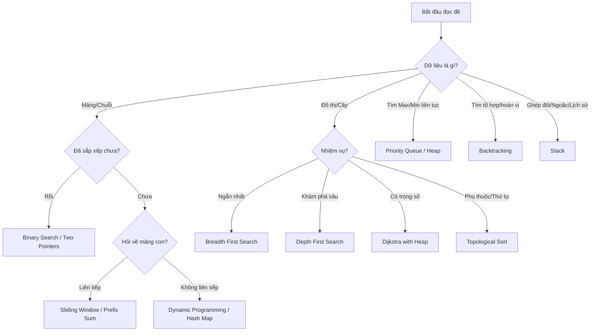

    # 🧠 GIÁO TRÌNH CẤU TRÚC DỮ LIỆU & GIẢI THUẬT (DSA)

## Từ Cơ Bản Đến Thành Thạo – Python Focused

> **Cập nhật:** 2026-03-17
> **Mục tiêu:** Chinh phục phỏng vấn kỹ thuật & tư duy lập trình chuyên sâu
> **Ngôn ngữ thực hành:** Python 3

---

## 📋 MỤC LỤC

| #                                            | Chủ đề                            | Level          | Tuần   |
| -------------------------------------------- | ------------------------------------ | -------------- | ------- |
| [1](#1-big-o-notation--tư-duy-tối-ưu)        | Big O Notation & Tư duy tối ưu    | 🟢 Cơ bản    | Tuần 1 |
| [2](#2-đệ-quy-recursion)                      | Đệ quy (Recursion)                 | 🟢 Cơ bản    | Tuần 1 |
| [3](#3-mảng-array--kỹ-thuật-cốt-lõi)       | Mảng (Array) & Kỹ thuật cốt lõi | 🟢 Cơ bản    | Tuần 2 |
| [4](#4-danh-sách-liên-kết-linked-list)       | Danh sách liên kết (Linked List)  | 🟡 Trung bình | Tuần 2 |
| [5](#5-ngăn-xếp-stack)                        | Ngăn xếp (Stack)                   | 🟡 Trung bình | Tuần 3 |
| [6](#6-hàng-đợi-queue)                       | Hàng đợi (Queue)                  | 🟡 Trung bình | Tuần 3 |
| [7](#7-bảng-băm-hash-table)                   | Bảng băm (Hash Table)              | 🟡 Trung bình | Tuần 4 |
| [8](#8-cây-nhị-phân--bst)                    | Cây nhị phân & BST                | 🔴 Nâng cao   | Tuần 5 |
| [9](#9-heap--priority-queue)                    | Heap & Priority Queue                | 🔴 Nâng cao   | Tuần 5 |
| [10](#10-đồ-thị-graph)                       | Đồ thị (Graph)                    | 🔴 Nâng cao   | Tuần 6 |
| [11](#11-trie)                                  | Trie (Cây tiền tố)                | 🔴 Nâng cao   | Tuần 6 |
| [12](#12-sắp-xếp-sorting-algorithms)          | Các thuật toán sắp xếp          | 🟡 Trung bình | Tuần 3 |
| [13](#13-tìm-kiếm-nhị-phân-binary-search)   | Tìm kiếm nhị phân                | 🟡 Trung bình | Tuần 3 |
| [14](#14-pattern-sliding-window)                | Pattern: Sliding Window              | 🔴 Nâng cao   | Tuần 7 |
| [15](#15-pattern-two-pointers)                  | Pattern: Two Pointers                | 🔴 Nâng cao   | Tuần 7 |
| [16](#16-quy-hoạch-động-dynamic-programming) | Quy hoạch động (DP)               | 🔴 Nâng cao   | Tuần 8 |
| [17](#17-greedy-algorithms)                     | Greedy Algorithms                    | 🔴 Nâng cao   | Tuần 8 |
| [18](#18-backtracking-quay-lui)                | Quay lui (Backtracking)            | 🔴 Nâng cao   | Tuần 9 |
| [19](#19-union-find-dsu)                      | Union-Find (DSU)                   | 🔴 Nâng cao   | Tuần 9 |
| [20](#20-bit-manipulation-thao-tác-bit)     | Thao tác Bit (Bit Manipulation)    | 🟡 Trung bình | Tuần 4 |
| [21](#21-pattern-recognition-guide)           | Hướng dẫn nhận diện Pattern        | ⭐ QUAN TRỌNG | Mọi lúc |
| [22](#22-neetcode-75-curated-list)             | List NeetCode 75 (Chọn lọc)       | 🚀 Chiến thực | -       |
| [23](#23-advanced-learning-strategies)         | Chiến lược học tập (Advanced)      | 🧠 Tư duy      | -       |
| [24](#24-lộ-trình-ôn-luyện-4-trạm-thực-chiến)   | Lộ trình Ôn luyện 4 Trạm           | 🔥 Tối thượng | -       |
| [25](#25-phụ-lục-thư-viện-code-mẫu-boilerplate-templates) | Thư viện Code Mẫu (Boilerplate) | 🛠️ Công cụ    | -       |

---

## 1. Big O Notation & Tư Duy Tối Ưu

### 📚 Khái niệm

Big O là cách đánh giá **hiệu năng** (thời gian và bộ nhớ) của thuật toán khi dữ liệu đầu vào tăng lên.

| Ký hiệu  | Tên         | Ví dụ thực tế                   |
| ---------- | ------------ | ----------------------------------- |
| O(1)       | Constant     | Truy cập phần tử mảng qua index |
| O(log n)   | Logarithmic  | Binary Search                       |
| O(n)       | Linear       | Duyệt toàn bộ mảng              |
| O(n log n) | Linearithmic | Merge Sort, Quick Sort              |
| O(n²)     | Quadratic    | Bubble Sort, vòng lặp lồng nhau  |
| O(2ⁿ)     | Exponential  | Fibonacci đệ quy không tối ưu  |
| O(n!)      | Factorial    | Sinh tất cả hoán vị             |

### 💡 Quy tắc phân tích nhanh

1. **Bỏ hằng số:** `O(2n)` → `O(n)`
2. **Bỏ số hạng nhỏ hơn:** `O(n² + n)` → `O(n²)`
3. **Hai vòng lặp nối tiếp:** `O(n + m)`
4. **Hai vòng lặp lồng nhau:** `O(n * m)`

### 🔍 Ví dụ so sánh thực tế

```python
import time

# ❌ O(n²) - Tìm cặp có tổng = target (cách ngây thơ)
def two_sum_naive(nums, target):
    for i in range(len(nums)):
        for j in range(i + 1, len(nums)):
            if nums[i] + nums[j] == target:
                return [i, j]
    return []

# ✅ O(n) - Tìm cặp có tổng = target (dùng Hash Map)
def two_sum_optimal(nums, target):
    seen = {}
    for i, num in enumerate(nums):
        complement = target - num
        if complement in seen:
            return [seen[complement], i]
        seen[num] = i
    return []

# Demo hiệu năng
import random
nums = [random.randint(1, 1000) for _ in range(10000)]
target = 999

start = time.time()
two_sum_naive(nums, target)
print(f"O(n²): {time.time() - start:.4f}s")

start = time.time()
two_sum_optimal(nums, target)
print(f"O(n):  {time.time() - start:.6f}s")
# Kết quả: O(n²) chậm hơn O(n) hàng trăm lần!
```

### 📝 Space Complexity (Độ phức tạp không gian)

```python
# O(1) space - không dùng thêm bộ nhớ
def reverse_in_place(arr):
    left, right = 0, len(arr) - 1
    while left < right:
        arr[left], arr[right] = arr[right], arr[left]
        left += 1
        right -= 1
    return arr

# O(n) space - dùng thêm mảng mới
def reverse_new_array(arr):
    return arr[::-1]
```

### 🎯 Bài tập

1. LeetCode **#1** – Two Sum → O(n) bằng HashMap
2. LeetCode **#217** – Contains Duplicate → O(n) bằng Set
3. LeetCode **#121** – Best Time to Buy and Sell Stock → O(n) một lượt duyệt

---

## 2. Đệ Quy (Recursion)

### 📚 Khái niệm

Hàm gọi chính nó để giải quyết bài toán con nhỏ hơn.

**3 thành phần bắt buộc:**

1. **Base case:** Điều kiện dừng (tránh infinite loop).
2. **Recursive case:** Gọi đệ quy với bài toán nhỏ hơn.
3. **Trust the recursion:** Tin rằng lời gọi đệ quy sẽ trả về đúng.

### 🔍 Ví dụ kinh điển

```python
# Giai thừa: n! = n × (n-1)!
def factorial(n):
    # Base case
    if n <= 1:
        return 1
    # Recursive case: tin rằng factorial(n-1) đúng
    return n * factorial(n - 1)

# Fibonacci với Memoization (Top-Down DP)
def fibonacci(n, memo={}):
    if n in memo:
        return memo[n]
    if n <= 1:
        return n
    memo[n] = fibonacci(n - 1, memo) + fibonacci(n - 2, memo)
    return memo[n]

# Fibonacci KHÔNG memoization: O(2ⁿ) → RẤT CHẬM
# Fibonacci CÓ memoization: O(n) → NHANH
```

### 💡 Kỹ thuật giải quyết thường gặp

1.  **Divide & Conquer (Chia để trị):** Chia bài toán lớn thành các bài toán con độc lập (vd: Merge Sort, Quick Sort).
2.  **Memoization (Ghi nhớ):** Lưu kết quả các lời gọi hàm trùng lặp để tránh tính toán lại (vd: Fibonacci).
3.  **Backtracking (Quay lui):** Thử tất cả các nhánh và quay lại khi gặp nhánh cụ thể không thỏa mãn (xem thêm chương 18).
4.  **Xác định Base Case:** Luôn bắt đầu bằng việc xác định điều kiện dừng để tránh lỗi Stack Overflow.

```
factorial(4)
├── 4 × factorial(3)
│   ├── 3 × factorial(2)
│   │   ├── 2 × factorial(1)
│   │   │   └── return 1        ← Base case
│   │   └── return 2 × 1 = 2
│   └── return 3 × 2 = 6
└── return 4 × 6 = 24
```

> ⚠️ **Lỗi thường gặp:** Quên Base case → Stack Overflow (đệ quy vô hạn)!

### 🎯 Bài tập

1. LeetCode **#206** – Reverse Linked List (đệ quy)
2. LeetCode **#104** – Maximum Depth of Binary Tree
3. LeetCode **#21** – Merge Two Sorted Lists (đệ quy)

---

## 3. Mảng (Array) & Kỹ Thuật Cốt Lõi

### 📚 Khái niệm

Dữ liệu lưu **liên tiếp trong bộ nhớ**, truy cập `O(1)` qua index.

```
Index:  [0]  [1]  [2]  [3]  [4]
Value:  [10] [20] [30] [40] [50]
Memory: 100  104  108  112  116   ← Địa chỉ liên tiếp
```

| Thao tác       | Độ phức tạp | Ghi chú                     |
| --------------- | --------------- | ---------------------------- |
| Access          | O(1)            | Tính địa chỉ trực tiếp |
| Search          | O(n)            | Phải duyệt từng phần tử |
| Insert (end)    | O(1) amortized  | Dynamic Array                |
| Insert (middle) | O(n)            | Phải dịch phần tử        |
| Delete          | O(n)            | Phải dịch phần tử        |

### 💡 Kỹ thuật giải quyết thường gặp

1.  **Two Pointers (Hai con trỏ):** Dùng cho mảng đã sắp xếp hoặc tìm cặp phần tử (xem chương 15).
2.  **Sliding Window (Cửa sổ trượt):** Dùng cho dãy con liên tiếp (xem chương 14).
3.  **Prefix Sum (Cộng dồn):** Tính nhanh tổng đoạn [L, R] trong O(1).
4.  **Kadane's Algorithm:** Tìm dãy con có tổng lớn nhất trong O(n).
5.  **Dutch National Flag:** Sắp xếp mảng chỉ có 3 loại phần tử (vd: 0, 1, 2) trong O(n).

```python
# Tính tổng bất kỳ đoạn [l, r] trong O(1)
class PrefixSum:
    def __init__(self, nums):
        self.prefix = [0] * (len(nums) + 1)
        for i, num in enumerate(nums):
            self.prefix[i + 1] = self.prefix[i] + num

    def range_sum(self, left, right):
        # Tổng từ index left đến right (inclusive)
        return self.prefix[right + 1] - self.prefix[left]

# Sử dụng
nums = [1, 2, 3, 4, 5]
ps = PrefixSum(nums)
print(ps.range_sum(1, 3))  # 2+3+4 = 9
print(ps.range_sum(0, 4))  # 1+2+3+4+5 = 15
```

### 🔧 Kỹ thuật Kadane's Algorithm (Maximum Subarray)

```python
def max_subarray(nums):
    """
    LeetCode #53 - Maximum Subarray
    Time: O(n), Space: O(1)
    """
    max_sum = nums[0]
    current_sum = nums[0]

    for num in nums[1:]:
        # Tại mỗi vị trí: tiếp tục dãy cũ HOẶC bắt đầu dãy mới
        current_sum = max(num, current_sum + num)
        max_sum = max(max_sum, current_sum)

    return max_sum

# Ví dụ: [-2, 1, -3, 4, -1, 2, 1, -5, 4]  → 6 ([4,-1,2,1])
```

### 🎯 Bài tập

1. LeetCode **#53** – Maximum Subarray (Kadane)
2. LeetCode **#238** – Product of Array Except Self (Prefix/Suffix)
3. LeetCode **#11** – Container With Most Water (Two Pointers)
4. LeetCode **#15** – 3Sum (Sorting + Two Pointers)

---

## 4. Danh Sách Liên Kết (Linked List)

### 📚 Khái niệm

Dữ liệu lưu **rải rác trong bộ nhớ**, mỗi node chứa giá trị và con trỏ sang node tiếp theo.

```
[10|next] → [20|next] → [30|next] → [40|NULL]
  head
```

| Thao tác       | Độ phức tạp | So sánh với Array |
| --------------- | --------------- | ------------------- |
| Access          | O(n)            | Array: O(1) ❌      |
| Search          | O(n)            | Array: O(n) =       |
| Insert (head)   | O(1)            | Array: O(n) ✅      |
| Insert (middle) | O(n)            | Array: O(n) =       |
| Delete (head)   | O(1)            | Array: O(n) ✅      |

### 🔧 Implement từ đầu

```python
class Node:
    def __init__(self, val=0, next=None):
        self.val = val
        self.next = next

class LinkedList:
    def __init__(self):
        self.head = None

    def append(self, val):
        """Thêm vào cuối: O(n)"""
        new_node = Node(val)
        if not self.head:
            self.head = new_node
            return
        curr = self.head
        while curr.next:
            curr = curr.next
        curr.next = new_node

    def prepend(self, val):
        """Thêm vào đầu: O(1)"""
        new_node = Node(val)
        new_node.next = self.head
        self.head = new_node

    def delete(self, val):
        """Xóa node với val đó: O(n)"""
        if not self.head:
            return
        if self.head.val == val:
            self.head = self.head.next
            return
        curr = self.head
        while curr.next:
            if curr.next.val == val:
                curr.next = curr.next.next
                return
            curr = curr.next

    def reverse(self):
        """Đảo ngược Linked List: O(n), O(1) space"""
        prev = None
        curr = self.head
        while curr:
            next_node = curr.next   # Lưu tạm node tiếp theo
            curr.next = prev        # Đảo chiều con trỏ
            prev = curr             # Tiến prev
            curr = next_node        # Tiến curr
        self.head = prev

    def __repr__(self):
        nodes = []
        curr = self.head
        while curr:
            nodes.append(str(curr.val))
            curr = curr.next
        return " → ".join(nodes) + " → NULL"
```

### 💡 Kỹ thuật giải quyết thường gặp

1.  **Dummy Node (Node giả):** Tạo một node phụ đứng trước `head` để xử lý các trường hợp xóa node đầu hoặc thêm vào đầu dễ dàng hơn.
2.  **Fast & Slow Pointers:** Tìm điểm giữa, tìm chu trình (Cycle detection).
3.  **Reverse Linked List:** Đảo ngược thứ tự node (Kỹ thuật nền tảng cho nhiều bài khó).
4.  **Hai con trỏ cách nhau K bước:** Tìm node thứ N từ cuối lên.

```python
def find_middle(head):
    """Tìm phần tử giữa – O(n), O(1) space"""
    slow = fast = head
    while fast and fast.next:
        slow = slow.next          # Đi 1 bước
        fast = fast.next.next    # Đi 2 bước
    return slow  # Khi fast đến cuối, slow ở giữa

def has_cycle(head):
    """Detect Cycle (Floyd's Algorithm) – O(n), O(1) space"""
    slow = fast = head
    while fast and fast.next:
        slow = slow.next
        fast = fast.next.next
        if slow == fast:      # Gặp nhau → có chu trình
            return True
    return False
```

### 🎯 Bài tập

1. LeetCode **#206** – Reverse Linked List
2. LeetCode **#141** – Linked List Cycle
3. LeetCode **#876** – Middle of the Linked List
4. LeetCode **#21** – Merge Two Sorted Lists
5. LeetCode **#19** – Remove Nth Node From End of List

---

## 5. Ngăn Xếp (Stack)

### 📚 Khái niệm

**LIFO** (Last In, First Out) – Vào sau ra trước. Giống như chồng sách.

```
Thêm:  PUSH →  [TOP: 30]   POP → Lấy 30
                     [20]
                     [10]
```

### 💡 Kỹ thuật giải quyết thường gặp

1.  **Monotonic Stack (Ngăn xếp đơn điệu):** Tìm phần tử lớn hơn/nhỏ hơn gần nhất (xem ví dụ dưới).
2.  **Valid Parentheses (Kiểm tra ngoặc):** Dùng Stack để lưu các dấu mở, pop khi gặp dấu đóng tương ứng.
3.  **Reverse Data (Đảo ngược dữ liệu):** Tận dụng tính chất LIFO để đảo ngược chuỗi hoặc danh sách.
4.  **Evaluate Expression:** Tính toán biểu thức toán học (vd: Postfix/Prefix notation).

```python
class Stack:
    def __init__(self):
        self.items = []

    def push(self, item):     # O(1)
        self.items.append(item)

    def pop(self):            # O(1)
        if self.is_empty():
            raise IndexError("Stack is empty")
        return self.items.pop()

    def peek(self):           # O(1)
        return self.items[-1] if self.items else None

    def is_empty(self):       # O(1)
        return len(self.items) == 0

    def size(self):
        return len(self.items)
```

### 🔧 Ứng dụng: Monotonic Stack

```python
def next_greater_element(nums):
    """
    Với mỗi phần tử, tìm phần tử lớn hơn gần nhất bên phải.
    Time: O(n) – mỗi phần tử chỉ push/pop 1 lần
    """
    n = len(nums)
    result = [-1] * n
    stack = []  # Lưu index

    for i in range(n):
        # Trong khi stack không rỗng và phần tử hiện tại lớn hơn phần tử stack top
        while stack and nums[i] > nums[stack[-1]]:
            idx = stack.pop()
            result[idx] = nums[i]  # nums[i] là "next greater" của result[idx]
        stack.append(i)

    return result

# [2, 1, 2, 4, 3] → [4, 2, 4, -1, -1]
```

### 🎯 Bài tập

1. LeetCode **#20** – Valid Parentheses
2. LeetCode **#155** – Min Stack
3. LeetCode **#739** – Daily Temperatures (Monotonic Stack)
4. LeetCode **#84** – Largest Rectangle in Histogram

---

## 6. Hàng Đợi (Queue)

### 📚 Khái niệm

**FIFO** (First In, First Out) – Vào trước ra trước. Giống như hàng đợi người mua vé.

```
Enqueue →  [10] [20] [30]  → Dequeue
                 FRONT          BACK
```

### 💡 Kỹ thuật giải quyết thường gặp

1.  **BFS (Breadth First Search):** Tìm đường đi ngắn nhất trong đồ thị không trọng số hoặc duyệt cây theo từng mức.
2.  **Sliding Window (Fixed Size):** Dùng Queue để duy trì các phần tử trong cửa sổ trượt.
3.  **Level Order Traversal:** Duyệt cây nhị phân theo từng tầng (Level by level).
4.  **Priority Queue:** Luôn lấy ra phần tử có ưu tiên cao nhất trong O(log n) (vd: Dijkstra, K-largest).

```python
from collections import deque

class Queue:
    """Dùng deque để đạt O(1) cho cả enqueue và dequeue"""
    def __init__(self):
        self.items = deque()

    def enqueue(self, item):   # O(1)
        self.items.append(item)

    def dequeue(self):         # O(1) với deque, O(n) nếu dùng list!
        if self.is_empty():
            raise IndexError("Queue is empty")
        return self.items.popleft()

    def front(self):
        return self.items[0] if self.items else None

    def is_empty(self):
        return len(self.items) == 0


# Priority Queue (Heap-based)
import heapq

class PriorityQueue:
    def __init__(self):
        self.heap = []

    def push(self, priority, item):
        heapq.heappush(self.heap, (priority, item))  # O(log n)

    def pop(self):
        return heapq.heappop(self.heap)   # O(log n)

    def peek(self):
        return self.heap[0]

    def is_empty(self):
        return len(self.heap) == 0
```

### 🔧 Queue và BFS (Breadth First Search)

```python
from collections import deque

def bfs(graph, start):
    """
    Duyệt đồ thị theo chiều rộng.
    BFS luôn tìm đường đi ngắn nhất (số cạnh nhỏ nhất).
    """
    visited = set([start])
    queue = deque([start])

    while queue:
        node = queue.popleft()
        print(node, end=" ")

        for neighbor in graph[node]:
            if neighbor not in visited:
                visited.add(neighbor)
                queue.append(neighbor)

# Đồ thị ví dụ
graph = {
    'A': ['B', 'C'],
    'B': ['D', 'E'],
    'C': ['F'],
    'D': [], 'E': [], 'F': []
}
bfs(graph, 'A')  # A B C D E F
```

### 🎯 Bài tập

1. LeetCode **#232** – Implement Queue using Stacks
2. LeetCode **#102** – Binary Tree Level Order Traversal (BFS)
3. LeetCode **#200** – Number of Islands (BFS)
4. LeetCode **#994** – Rotting Oranges (Multi-source BFS)

---

## 7. Bảng Băm (Hash Table)

### 📚 Khái niệm

Ánh xạ **key → value** với thao tác trung bình O(1).

```
Hash Function:   "apple" → hash() → 3
                              ↓
Table:  [0][ ][...]  [3]["apple" → 5]  [...]
                     ↑
                     Bucket
```

### 💡 Kỹ thuật giải quyết thường gặp

1.  **Frequency Counter (Đếm tần suất):** Đếm số lần xuất hiện của các phần tử để giải quyết bài toán Anagram, Phân loại.
2.  **Two Sum Pattern:** Dùng Hash Map để lưu `value: index`, giúp tìm cặp phần tử trong O(n).
3.  **Grouping (Nhóm phần tử):** Dùng key là giá trị đã được chuẩn hóa (vd: sort chuỗi) để nhóm các phần tử liên quan (vd: Group Anagrams).
4.  **Caching / Memoization:** Lưu kết quả trung gian để tối ưu tốc độ.

```python
# 1. Đếm tần suất
def char_frequency(s):
    freq = {}
    for char in s:
        freq[char] = freq.get(char, 0) + 1
    return freq

# Tương đương với:
from collections import Counter
freq = Counter("abracadabra")
# Counter({'a': 5, 'b': 2, 'r': 2, 'c': 1, 'd': 1})

# 2. Kiểm tra anagram – O(n)
def is_anagram(s, t):
    return Counter(s) == Counter(t)

# 3. Group Anagrams – O(n * k) với k là độ dài chuỗi trung bình
def group_anagrams(strs):
    groups = {}
    for s in strs:
        key = tuple(sorted(s))  # Sắp xếp chữ cái làm key
        groups.setdefault(key, []).append(s)
    return list(groups.values())

# ["eat","tea","tan","ate","nat","bat"]
# → [["eat","tea","ate"],["tan","nat"],["bat"]]
```

### 🎯 Bài tập

1. LeetCode **#1** – Two Sum
2. LeetCode **#242** – Valid Anagram
3. LeetCode **#49** – Group Anagrams
4. LeetCode **#128** – Longest Consecutive Sequence

---

## 8. Cây Nhị Phân & BST

### 📚 Khái niệm

```
       8
      / \
     3   10
    / \    \
   1   6    14
      / \   /
     4   7 13
```

**BST Property:** Node trái < Node hiện tại < Node phải

### 💡 Kỹ thuật giải quyết thường gặp

1.  **DFS (Pre/In/Post Order):** Duyệt cây theo chiều sâu. Inorder trên BST giúp lấy phần tử theo thứ tự tăng dần.
2.  **BFS (Level Order):** Duyệt cây theo chiều rộng, tìm khoảng cách ngắn nhất từ gốc.
3.  **Recursion on Trees:** Hầu hết các bài toán cây đều giải bằng đệ quy (vd: tính chiều cao, kiểm tra cây đối xứng).
4.  **Lowest Common Ancestor (LCA):** Tìm tổ tiên chung gần nhất của hai node.
5.  **Path Sum:** Duyệt và tính tổng các giá trị trên đường đi từ gốc đến lá.

```python
class TreeNode:
    def __init__(self, val=0, left=None, right=None):
        self.val = val
        self.left = left
        self.right = right

# ── 3 kiểu duyệt DFS ──────────────────────────────────────
def inorder(root):
    """Trái → Root → Phải | BST → sắp xếp tăng dần"""
    if not root:
        return []
    return inorder(root.left) + [root.val] + inorder(root.right)

def preorder(root):
    """Root → Trái → Phải | Dùng sao chép/serialize cây"""
    if not root:
        return []
    return [root.val] + preorder(root.left) + preorder(root.right)

def postorder(root):
    """Trái → Phải → Root | Dùng xóa cây, tính kích thước"""
    if not root:
        return []
    return postorder(root.left) + postorder(root.right) + [root.val]

# ── BFS (Level Order) ──────────────────────────────────────
from collections import deque

def level_order(root):
    if not root:
        return []
    result = []
    queue = deque([root])
    while queue:
        level_size = len(queue)
        level_nodes = []
        for _ in range(level_size):
            node = queue.popleft()
            level_nodes.append(node.val)
            if node.left:  queue.append(node.left)
            if node.right: queue.append(node.right)
        result.append(level_nodes)
    return result

# ── BST Search ─────────────────────────────────────────────
def search_bst(root, val):
    """Tìm kiếm trong BST: O(h), h = chiều cao cây"""
    if not root or root.val == val:
        return root
    if val < root.val:
        return search_bst(root.left, val)
    return search_bst(root.right, val)
```

### 🎯 Bài tập

1. LeetCode **#104** – Maximum Depth of Binary Tree
2. LeetCode **#226** – Invert Binary Tree
3. LeetCode **#102** – Binary Tree Level Order Traversal
4. LeetCode **#235** – Lowest Common Ancestor of BST
5. LeetCode **#98** – Validate Binary Search Tree

---

## 9. Heap & Priority Queue

### 📚 Khái niệm

**Min Heap:** Phần tử nhỏ nhất luôn ở gốc.
**Max Heap:** Phần tử lớn nhất luôn ở gốc.

```
Min Heap:        Max Heap:
      1                10
    /   \            /    \
   3     5          9      8
  / \   /          / \    /
 7   4  6         7   6  3
```

### 💡 Kỹ thuật giải quyết thường gặp

1.  **Top K Elements:** Duy trì một Heap kích thước K để tìm K phần tử lớn nhất/nhỏ nhất trong O(n log k).
2.  **Median Finding:** Dùng 2 Heap (Max-Heap cho nửa dưới, Min-Heap cho nửa trên) để tìm trung vị trong dòng dữ liệu.
3.  **Merge K Sorted Lists:** Dùng Min-Heap để lấy phần tử nhỏ nhất từ K danh sách đã sắp xếp.

```python
import heapq

# Python chỉ có Min Heap
min_heap = [3, 1, 4, 1, 5, 9, 2, 6]
heapq.heapify(min_heap)      # O(n)

heapq.heappush(min_heap, 0)  # O(log n)
smallest = heapq.heappop(min_heap)  # O(log n) → trả về 0

# Max Heap: dùng giá trị âm
max_heap = [-3, -1, -4, -1, -5]
heapq.heapify(max_heap)
largest = -heapq.heappop(max_heap)  # Lấy giá trị lớn nhất


# ── Tìm K phần tử lớn nhất ────────────────────────────────
def k_largest(nums, k):
    """O(n log k) – hiệu quả hơn sort O(n log n)"""
    return heapq.nlargest(k, nums)

# ── Top K Frequent Elements ────────────────────────────────
def top_k_frequent(nums, k):
    count = Counter(nums)
    # nlargest(k, iterable, key=...)
    return heapq.nlargest(k, count.keys(), key=count.get)
```

### 🎯 Bài tập

1. LeetCode **#703** – Kth Largest Element in a Stream
2. LeetCode **#347** – Top K Frequent Elements
3. LeetCode **#295** – Find Median from Data Stream
4. LeetCode **#23** – Merge K Sorted Lists

---

---

## 10. Đồ Thị (Graph)

### 📚 Khái niệm

Tập các **đỉnh (vertices)** và **cạnh (edges)** nối chúng.

| Loại                   | Mô tả                                                |
| ----------------------- | ------------------------------------------------------ |
| **Directed**      | Cạnh có hướng (A → B, nhưng không phải B → A) |
| **Undirected**    | Cạnh không hướng (A — B)                          |
| **Weighted**      | Cạnh có trọng số (A --(5)--> B)                    |
| **Cyclic**        | Có chu trình                                         |
| **Acyclic (DAG)** | Không có chu trình (dùng trong Topological Sort)   |

### 💡 Kỹ thuật giải quyết thường gặp

1.  **Dijkstra's Algorithm:** Tìm đường đi ngắn nhất trong đồ thị có trọng số dương.
2.  **Topological Sort:** Sắp xếp thứ tự thực hiện công việc (vd: Course Schedule). Dùng cho Đồ thị có hướng không chu trình (DAG).
3.  **Cycle Detection:** Kiểm tra chu trình trong đồ thị (Dùng DFS với mảng `visited` 3 trạng thái hoặc DSU).
4.  **Island / Flood Fill:** Dùng DFS/BFS để loang và đếm số vùng liên thông trong ma trận 2D.
5.  **Multi-source BFS:** Bắt đầu BFS từ nhiều điểm cùng lúc để tìm đường đi ngắn nhất đồng thời.

### 🔧 Biểu diễn đồ thị

```python
# Adjacency List (Danh sách kề) – phổ biến nhất
graph = {
    'A': ['B', 'C'],
    'B': ['A', 'D', 'E'],
    'C': ['A', 'F'],
    'D': ['B'],
    'E': ['B', 'F'],
    'F': ['C', 'E']
}

# ── DFS (Depth First Search) ────────────────────────────────
def dfs(graph, start, visited=None):
    if visited is None:
        visited = set()
    visited.add(start)
    print(start, end=" ")
    for neighbor in graph[start]:
        if neighbor not in visited:
            dfs(graph, neighbor, visited)
    return visited

# ── BFS (Breadth First Search) ──────────────────────────────
def bfs(graph, start):
    visited = {start}
    queue = deque([start])
    while queue:
        node = queue.popleft()
        print(node, end=" ")
        for neighbor in graph[node]:
            if neighbor not in visited:
                visited.add(neighbor)
                queue.append(neighbor)
```

### 🔧 Thuật toán Dijkstra (Đường đi ngắn nhất)

```python
import heapq

def dijkstra(graph, start):
    """
    graph: {node: [(cost, neighbor), ...]}
    Trả về {node: shortest_distance}
    Time: O((V + E) log V)
    """
    distances = {node: float('inf') for node in graph}
    distances[start] = 0
    pq = [(0, start)]  # (distance, node)

    while pq:
        curr_dist, curr_node = heapq.heappop(pq)

        if curr_dist > distances[curr_node]:
            continue  # Đã tìm được đường ngắn hơn rồi

        for cost, neighbor in graph[curr_node]:
            distance = curr_dist + cost
            if distance < distances[neighbor]:
                distances[neighbor] = distance
                heapq.heappush(pq, (distance, neighbor))

    return distances

# Ví dụ
graph = {
    'A': [(1, 'B'), (4, 'C')],
    'B': [(2, 'C'), (5, 'D')],
    'C': [(1, 'D')],
    'D': []
}
print(dijkstra(graph, 'A'))
# {'A': 0, 'B': 1, 'C': 3, 'D': 4}
```

### 🎯 Bài tập

1. LeetCode **#200** – Number of Islands (DFS/BFS)
2. LeetCode **#133** – Clone Graph
3. LeetCode **#207** – Course Schedule (Cycle Detection)
4. LeetCode **#743** – Network Delay Time (Dijkstra)
5. LeetCode **#127** – Word Ladder (BFS)

---

## 11. Trie

### 💡 Kỹ thuật giải quyết thường gặp

1.  **Prefix Search (Tìm kiếm tiền tố):** Kiểm tra xem một tập hợp từ có bắt đầu bằng một chuỗi cho trước không.
2.  **Autocomplete / Word Suggestion:** Tìm tất cả các từ trong Trie có chung tiền tố.
3.  **Word Matrix / Crossword:** Kết hợp Trie + Backtracking để tìm từ trong một bảng chữ cái.
4.  **XOR Maximum:** Dùng Trie để lưu dạng nhị phân của số, giúp tìm cặp số có XOR lớn nhất trong O(bit_count).

Cây đặc biệt lưu **chuỗi ký tự**, tối ưu cho tìm kiếm prefix.

```
Trie chứa: ["app", "apple", "apt", "bat"]

        root
       /    \
      a      b
      |      |
      p      a
     / \     |
    p   t    t
    |
    l
    |
    e
```

### 🔧 Implement Trie

```python
class TrieNode:
    def __init__(self):
        self.children = {}      # char → TrieNode
        self.is_end_word = False

class Trie:
    def __init__(self):
        self.root = TrieNode()

    def insert(self, word):
        """O(m) – m là độ dài word"""
        node = self.root
        for char in word:
            if char not in node.children:
                node.children[char] = TrieNode()
            node = node.children[char]
        node.is_end_word = True

    def search(self, word):
        """O(m)"""
        node = self.root
        for char in word:
            if char not in node.children:
                return False
            node = node.children[char]
        return node.is_end_word

    def starts_with(self, prefix):
        """O(m) – Kiểm tra prefix"""
        node = self.root
        for char in prefix:
            if char not in node.children:
                return False
            node = node.children[char]
        return True

# Sử dụng
trie = Trie()
trie.insert("apple")
print(trie.search("apple"))    # True
print(trie.search("app"))      # False
print(trie.starts_with("app")) # True
```

### 🎯 Bài tập

1. LeetCode **#208** – Implement Trie (Prefix Tree)
2. LeetCode **#212** – Word Search II
3. LeetCode **#211** – Design Add and Search Words

---

## 12. Sắp Xếp (Sorting Algorithms)

### 💡 Kỹ thuật giải quyết thường gặp

1.  **Dutch National Flag (3-way partition):** Dùng trong Quick Sort hoặc bài toán sắp xếp 3 loại phần tử.
2.  **K-th Smallest / Largest:** Dùng Quick Select (biến thể của Quick Sort) để tìm trong O(n) average.
3.  **External Sorting:** Kỹ thuật dùng khi dữ liệu quá lớn không thể nạp hết vào RAM (dùng Merge Sort).
4.  **Custom Sorting:** Sắp xếp theo nhiều tiêu chí (vd: theo điểm số, nếu bằng điểm thì theo tên).

| Thuật toán        | Time (Avg) | Time (Worst) | Space    | Stable?      |
| ------------------- | ---------- | ------------ | -------- | ------------ |
| Bubble Sort         | O(n²)     | O(n²)       | O(1)     | ✅           |
| Selection Sort      | O(n²)     | O(n²)       | O(1)     | ❌           |
| Insertion Sort      | O(n²)     | O(n²)       | O(1)     | ✅           |
| Merge Sort          | O(n log n) | O(n log n)   | O(n)     | ✅           |
| Quick Sort          | O(n log n) | O(n²)       | O(log n) | ❌           |
| Heap Sort           | O(n log n) | O(n log n)   | O(1)     | ❌           |
| Counting Sort       | O(n + k)   | O(n + k)     | O(k)     | ✅           |
| Python `sorted()` | O(n log n) | O(n log n)   | O(n)     | ✅ (Timsort) |

### 🔧 1. Bubble Sort (Sắp xếp nổi bọt)
```python
def bubble_sort(arr):
    """
    Ý tưởng: Đưa phần tử lớn nhất về cuối mảng sau mỗi vòng lặp.
    O(n^2), Space O(1). Phù hợp cho mảng nhỏ hoặc đã gần sắp xếp.
    """
    n = len(arr)
    for i in range(n):
        swapped = False
        for j in range(0, n - i - 1):
            if arr[j] > arr[j + 1]:
                arr[j], arr[j + 1] = arr[j + 1], arr[j]
                swapped = True
        if not swapped: # Tối ưu: Nếu không có swap nào, mảng đã xong
            break
    return arr
```

### 🔧 2. Selection Sort (Sắp xếp chọn)
```python
def selection_sort(arr):
    """
    Ý tưởng: Tìm phần tử nhỏ nhất trong phần chưa sắp xếp và đưa lên đầu.
    O(n^2), Space O(1). Luôn chạy O(n^2) bất kể dữ liệu.
    """
    n = len(arr)
    for i in range(n):
        min_idx = i
        for j in range(i + 1, n):
            if arr[j] < arr[min_idx]:
                min_idx = j
        arr[i], arr[min_idx] = arr[min_idx], arr[i]
    return arr
```

### 🔧 3. Insertion Sort (Sắp xếp chèn)
```python
def insertion_sort(arr):
    """
    Ý tưởng: Lấy từng phần tử và 'chèn' vào đúng vị trí trong phần đã sắp xếp.
    O(n^2), Space O(1). Cực nhanh cho mảng nhỏ hoặc mảng gần sắp xếp (O(n)).
    """
    for i in range(1, len(arr)):
        key = arr[i]
        j = i - 1
        while j >= 0 and key < arr[j]:
            arr[j + 1] = arr[j]
            j -= 1
        arr[j + 1] = key
    return arr
```

### 🔧 4. Merge Sort (Sắp xếp trộn)
```python
def merge_sort(arr):
    """Stable, O(n log n) guaranteed. Tốt cho Linked List"""
    if len(arr) <= 1:
        return arr

    mid = len(arr) // 2
    left = merge_sort(arr[:mid])
    right = merge_sort(arr[mid:])

    # Merge hai nửa đã sắp xếp
    result = []
    i = j = 0
    while i < len(left) and j < len(right):
        if left[i] <= right[j]:
            result.append(left[i]); i += 1
        else:
            result.append(right[j]); j += 1
    result.extend(left[i:])
    result.extend(right[j:])
    return result
```

### 🔧 5. Quick Sort (Sắp xếp nhanh)
```python
def quick_sort(arr, low=0, high=None):
    """In-place, O(n log n) average. Tốt cho Array"""
    if high is None:
        high = len(arr) - 1

    if low < high:
        pivot_idx = partition(arr, low, high)
        quick_sort(arr, low, pivot_idx - 1)
        quick_sort(arr, pivot_idx + 1, high)
    return arr

def partition(arr, low, high):
    pivot = arr[high]
    i = low - 1
    for j in range(low, high):
        if arr[j] <= pivot:
            i += 1
            arr[i], arr[j] = arr[j], arr[i]
    arr[i + 1], arr[high] = arr[high], arr[i + 1]
    return i + 1
```

### 🔧 6. Heap Sort (Sắp xếp dựa trên Heap)
```python
import heapq

def heap_sort(arr):
    """O(n log n), Space O(1) nếu implement in-place chân chính."""
    # Bản Python dùng thêm bộ nhớ O(n)
    heapq.heapify(arr)
    return [heapq.heappop(arr) for _ in range(len(arr))]
```

### 🔧 7. Counting Sort (Sắp xếp đếm - Không so sánh)
```python
def counting_sort(arr):
    """
    O(n + k) với k là khoảng giá trị. 
    Chỉ dùng khi biết khoảng giá trị nhỏ (vd: sắp xếp tuổi, điểm số).
    """
    if not arr: return arr
    max_val = max(arr)
    min_val = min(arr)
    count = [0] * (max_val - min_val + 1)
    
    for x in arr:
        count[x - min_val] += 1
        
    res = []
    for i, val in enumerate(count):
        res.extend([i + min_val] * val)
    return res
```

---

## 13. Tìm Kiếm Nhị Phân (Binary Search)

### 💡 Kỹ thuật giải quyết thường gặp

1.  **Binary Search on Answer (Tìm kiếm trên khoảng đáp án):** Thay vì tìm trong mảng, ta tìm giá trị đáp án tối ưu trong khoảng [min, max].
2.  **Searching in Rotated Array:** Áp dụng BS cho mảng đã bị xoay (vd: [4,5,6,7,0,1,2]).
3.  **Find Peak Element:** Tìm phần tử cực đại trong mảng không sắp xếp hoàn toàn (Dùng BS để quyết định hướng đi).
4.  **Square Root / Powers:** Tính căn bậc hai hoặc lũy thừa bằng BS.

Tìm kiếm trong mảng **đã sắp xếp** bằng cách chia đôi không gian tìm kiếm. O(log n).

### 🔧 Template chuẩn (3 biến thể)

```python
# ── Biến thể 1: Tìm chính xác ─────────────────────────────
def binary_search(nums, target):
    left, right = 0, len(nums) - 1

    while left <= right:
        mid = left + (right - left) // 2  # Tránh overflow
        if nums[mid] == target:
            return mid
        elif nums[mid] < target:
            left = mid + 1
        else:
            right = mid - 1

    return -1


# ── Biến thể 2: Tìm vị trí đầu tiên >= target ─────────────
def lower_bound(nums, target):
    """Leftmost position"""
    left, right = 0, len(nums)
    while left < right:
        mid = (left + right) // 2
        if nums[mid] < target:
            left = mid + 1
        else:
            right = mid
    return left


# ── Biến thể 3: BS trên khoảng giá trị ──────────────────
def min_days_to_bloom(bloomDay, m, k):
    """
    LeetCode #1482 – Minimum Number of Days to Make m Bouquets
    Không tìm trong mảng, mà tìm giá trị đáp án tối ưu!
    """
    def can_make(day):
        bouquets = flowers = 0
        for d in bloomDay:
            if d <= day:
                flowers += 1
                if flowers == k:
                    bouquets += 1
                    flowers = 0
            else:
                flowers = 0
        return bouquets >= m

    left, right = min(bloomDay), max(bloomDay)
    result = -1

    while left <= right:
        mid = (left + right) // 2
        if can_make(mid):
            result = mid
            right = mid - 1  # Tìm ngày nhỏ hơn khả thi
        else:
            left = mid + 1

    return result
```

### 🎯 Bài tập

1. LeetCode **#704** – Binary Search
2. LeetCode **#153** – Find Minimum in Rotated Sorted Array
3. LeetCode **#33** – Search in Rotated Sorted Array
4. LeetCode **#875** – Koko Eating Bananas (BS on value)
5. LeetCode **#410** – Split Array Largest Sum (BS on value)

---

---

## 14. Pattern: Sliding Window

### 📚 Khi nào dùng?

- Bài toán liên quan đến **dãy con liên tiếp** (subarray/substring).
- Tìm length, sum, hoặc property của một window.
- Có thể tối ưu từ O(n²) brute force → O(n).

### 💡 Kỹ thuật giải quyết thường gặp

1.  **Fixed Size Window:** Dùng khi đề bài yêu cầu dãy con có độ dài K cố định. Chỉ cần `window_sum += nums[i] - nums[i-k]`.
2.  **Variable Size Window:** Dùng khi tìm dãy con thỏa mãn điều kiện (vd: tổng >= S). Mở rộng `right`, thu hẹp `left` khi vi phạm điều kiện.
3.  **Frequency Dictionary:** Dùng kèm để lưu số lần xuất hiện của ký tự trong cửa sổ hiện tại (vd: Longest substring with K distinct characters).
4.  **At Most K --> Exactly K:** Một số bài khó yêu cầu "Exactly K", thường được giải bằng `Solution(At Most K) - Solution(At Most K-1)`.

### 🔧 Template chuẩn

```python
# ── Fixed Size Window ──────────────────────────────────────
def max_sum_subarray_k(nums, k):
    """Tổng lớn nhất của dãy con có k phần tử: O(n)"""
    window_sum = sum(nums[:k])
    max_sum = window_sum

    for i in range(k, len(nums)):
        window_sum += nums[i] - nums[i - k]  # Thêm mới, bỏ cũ
        max_sum = max(max_sum, window_sum)

    return max_sum


# ── Variable Size Window ────────────────────────────────────
def longest_substring_k_distinct(s, k):
    """
    Chuỗi con dài nhất với tối đa k ký tự phân biệt.
    LeetCode #340
    Time: O(n)
    """
    from collections import defaultdict
    char_count = defaultdict(int)
    left = 0
    max_len = 0

    for right in range(len(s)):
        char_count[s[right]] += 1            # Mở rộng window

        while len(char_count) > k:           # Thu hẹp khi vi phạm
            char_count[s[left]] -= 1
            if char_count[s[left]] == 0:
                del char_count[s[left]]
            left += 1

        max_len = max(max_len, right - left + 1)  # Cập nhật đáp án

    return max_len
```

### 🎯 Bài tập

1. LeetCode **#3** – Longest Substring Without Repeating Characters
2. LeetCode **#76** – Minimum Window Substring ⭐
3. LeetCode **#424** – Longest Repeating Character Replacement
4. LeetCode **#567** – Permutation in String

---

---

## 15. Pattern: Two Pointers

### 📚 Khi nào dùng?

- Mảng/chuỗi **đã sắp xếp**.
- Tìm cặp/bộ phần tử thỏa điều kiện.
- So sánh hai mảng.

### 💡 Kỹ thuật giải quyết thường gặp

1.  **Opposite Direction (Hai đầu ngược nhau):** Dùng cho mảng đã sắp xếp (vd: Two Sum II, 3Sum, Trapping Rain Water).
2.  **Same Direction (Hai con trỏ cùng chiều):** Thường gọi là Fast & Slow pointers, dùng để khử trùng lặp hoặc tìm dãy con.
3.  **Two Arrays:** Dùng hai con trỏ trên hai mảng khác nhau (vd: Merge Sorted Arrays).
4.  **Cycle Detection:** Floyd's Tortoise and Hare (Rùa và Thỏ) dùng cho Linked List hoặc dãy số có chu trình.

### 🔧 Ví dụ kinh điển

```python
# ── 3Sum – O(n²) giảm từ O(n³) brute force ─────────────────
def three_sum(nums):
    """LeetCode #15"""
    nums.sort()
    result = []

    for i in range(len(nums) - 2):
        if i > 0 and nums[i] == nums[i - 1]:
            continue  # Bỏ qua duplicate

        left, right = i + 1, len(nums) - 1
        while left < right:
            total = nums[i] + nums[left] + nums[right]
            if total == 0:
                result.append([nums[i], nums[left], nums[right]])
                while left < right and nums[left] == nums[left + 1]:
                    left += 1
                while left < right and nums[right] == nums[right - 1]:
                    right -= 1
                left += 1; right -= 1
            elif total < 0:
                left += 1
            else:
                right -= 1

    return result


# ── Trapping Rain Water – O(n), O(1) space ─────────────────
def trap(height):
    """LeetCode #42 – Kinh điển nhất về Two Pointers"""
    left, right = 0, len(height) - 1
    left_max = right_max = 0
    water = 0

    while left < right:
        if height[left] < height[right]:
            if height[left] >= left_max:
                left_max = height[left]
            else:
                water += left_max - height[left]
            left += 1
        else:
            if height[right] >= right_max:
                right_max = height[right]
            else:
                water += right_max - height[right]
            right -= 1

    return water
```

### 🎯 Bài tập

1. LeetCode **#167** – Two Sum II (Sorted Array)
2. LeetCode **#15** – 3Sum
3. LeetCode **#42** – Trapping Rain Water ⭐
4. LeetCode **#11** – Container With Most Water

---

---

## 16. Quy Hoạch Động (Dynamic Programming)

### 📚 Khái niệm

DP giải bài toán bằng cách chia thành **bài toán con chồng lấp** và **lưu kết quả** (memoization/tabulation).

**Dấu hiệu nhận biết DP:**

- "Tối đa / tối thiểu / đếm số cách..."
- Bài toán có bài toán con trùng lặp

### 💡 Kỹ thuật giải quyết thường gặp

1.  **Iterative with Tabulation (Bottom-Up):** Thường nhanh hơn và tránh Stack Overflow. Xây dựng bảng từ các trường hợp cơ sở đi lên.
2.  **Recursive with Memoization (Top-Down):** Dễ tư duy hơn từ bài toán lớn xuống bài toán nhỏ.
3.  **State Compression (Tối ưu không gian):** Nếu `dp[i]` chỉ phụ thuộc vào `dp[i-1]`, ta có thể dùng biến lẻ thay vì mảng để đạt O(1) space.
4.  **Decision Making:** Tại mỗi bước có các lựa chọn (vd: Chọn hoặc Không chọn phần tử hiện tại - bài toán Cái Túi / Knapsack).

### 🔧 Framework giải DP

```python
# ── 1. Top-Down (Memoization + Recursion) ─────────────────
def climb_stairs_memo(n, memo={}):
    """LeetCode #70 – Climbing Stairs"""
    if n in memo: return memo[n]
    if n <= 2: return n
    memo[n] = climb_stairs_memo(n - 1, memo) + climb_stairs_memo(n - 2, memo)
    return memo[n]


# ── 2. Bottom-Up (Tabulation) ─────────────────────────────
def climb_stairs_dp(n):
    """O(n) time, O(n) space"""
    if n <= 2: return n
    dp = [0] * (n + 1)
    dp[1] = 1
    dp[2] = 2
    for i in range(3, n + 1):
        dp[i] = dp[i - 1] + dp[i - 2]
    return dp[n]


# ── 3. Space Optimized ─────────────────────────────────────
def climb_stairs_optimal(n):
    """O(n) time, O(1) space"""
    if n <= 2: return n
    prev2, prev1 = 1, 2
    for _ in range(3, n + 1):
        curr = prev1 + prev2
        prev2, prev1 = prev1, curr
    return prev1


# ── Longest Common Subsequence – O(m*n) ────────────────────
def longest_common_subsequence(text1, text2):
    """LeetCode #1143 – Template cho nhiều bài DP 2D"""
    m, n = len(text1), len(text2)
    dp = [[0] * (n + 1) for _ in range(m + 1)]

    for i in range(1, m + 1):
        for j in range(1, n + 1):
            if text1[i - 1] == text2[j - 1]:
                dp[i][j] = dp[i - 1][j - 1] + 1
            else:
                dp[i][j] = max(dp[i - 1][j], dp[i][j - 1])

    return dp[m][n]
```

### 🎯 Bài tập

1. LeetCode **#70** – Climbing Stairs
2. LeetCode **#198** – House Robber
3. LeetCode **#300** – Longest Increasing Subsequence
4. LeetCode **#1143** – Longest Common Subsequence ⭐
5. LeetCode **#322** – Coin Change ⭐

---

---

## 17. Greedy Algorithms

### 📚 Khái niệm

Ở mỗi bước, chọn lựa **tối ưu cục bộ** với hy vọng đạt được **tối ưu toàn cục**.

**Khác DP:** Greedy không cần xem xét lại quyết định cũ.

### 💡 Kỹ thuật giải quyết thường gặp

1.  **Sorting First:** Rất nhiều bài Greedy yêu cầu phải sắp xếp dữ liệu trước (vd: Sắp xếp theo thời gian kết thúc của công việc).
2.  **Local vs Global:** Luôn đặt câu hỏi: "Nếu tôi chọn cái tốt nhất bây giờ, liệu nó có dẫn đến kết quả tốt nhất cuối cùng không?".
3.  **Priority Queue:** Dùng để luôn lấy ra phần tử "tốt nhất" hiện tại trong quá trình cập nhật liên tục.

### 🔧 Ví dụ

```python
def can_jump(nums):
    """
    LeetCode #55 – Jump Game
    Tham lam: Luôn theo dõi vị trí xa nhất có thể nhảy đến.
    """
    max_reach = 0
    for i, jump in enumerate(nums):
        if i > max_reach:
            return False  # Không thể đến đây
        max_reach = max(max_reach, i + jump)
    return True


def merge_intervals(intervals):
    """
    LeetCode #56 – Merge Intervals
    Sắp xếp theo start, tham lam merge các interval chồng lấp.
    """
    intervals.sort(key=lambda x: x[0])
    merged = [intervals[0]]

    for start, end in intervals[1:]:
        if start <= merged[-1][1]:          # Chồng lấp
            merged[-1][1] = max(merged[-1][1], end)  # Mở rộng
        else:
            merged.append([start, end])

    return merged
```

### 🎯 Bài tập

1. LeetCode **#55** – Jump Game
2. LeetCode **#45** – Jump Game II
3. LeetCode **#56** – Merge Intervals ⭐
4. LeetCode **#435** – Non-overlapping Intervals

---

## 🗺️ LỘ TRÌNH THỰC HÀNH TỔNG HỢP

### Checklist 8 tuần

```
Tuần 1: Big O + Recursion
  ☐ Phân tích Big O của 5 đoạn code bất kỳ mỗi ngày
  ☐ LeetCode Easy: #1, #217, #121, #70, #21

Tuần 2: Array + Linked List
  ☐ Implement Array, LinkedList thủ công (không dùng built-in)
  ☐ LeetCode Easy: #206, #141, #876, #21, #238
  ☐ LeetCode Medium: #19, #148, #11

Tuần 3: Stack + Queue + Sorting + Binary Search
  ☐ Implement Stack (Monotonic), Queue (deque)
  ☐ Implement Merge Sort, Quick Sort
  ☐ LeetCode Easy: #20, #155, #704
  ☐ LeetCode Medium: #739, #153, #875

Tuần 4: Hash Table
  ☐ LeetCode Easy: #1, #242, #217
  ☐ LeetCode Medium: #49, #128, #347

Tuần 5: Trees + Heap
  ☐ Implement BST: insert, search, inorder
  ☐ Thực hành BFS (level order) và DFS (pre/in/post)
  ☐ LeetCode Medium: #102, #235, #98, #347, #295

Tuần 6: Graph + Trie
  ☐ Implement DFS, BFS, Dijkstra
  ☐ Implement Trie
  ☐ LeetCode Medium: #200, #207, #743, #208

Tuần 7: Sliding Window + Two Pointers
  ☐ Áp dụng template cho các bài toán subarray/substring
  ☐ LeetCode Medium: #3, #76, #424, #15, #42

Tuần 8: Dynamic Programming + Greedy
  ☐ Phân biệt rõ khi nào dùng DP, khi nào dùng Greedy
  ☐ LeetCode Medium: #198, #300, #1143, #322, #56, #55
```

### Mục tiêu LeetCode

| Giai đoạn            | Số bài    | Trọng tâm             |
| ---------------------- | ----------- | ----------------------- |
| Sau 8 tuần            | 80+ Easy    | Hiểu patterns cơ bản |
| Sau 16 tuần           | 100+ Medium | Tư duy tối ưu        |
| Sẵn sàng phỏng vấn | 20+ Hard    | Áp lực thực chiến   |

---

*📌 Ghi chú: Mỗi bài LeetCode nên làm theo trình tự: **Brute Force → Optimal Solution → Phân tích Big O → Code sạch thủ công***

---

---

## 18. Backtracking (Quay lui)

### 📚 Khái niệm

Backtracking là một biến thể của đệ quy, dùng để giải quyết các bài toán **tìm tất cả (HOẶC một)** cấu hình thỏa mãn điều kiện (Hoán vị, Tổ hợp, Tìm đường trong mê cung).

**Triết lý:** "Thử - Sai - Sửa". Nếu đi vào một nhánh không khả thi, ta bước ngược lại (backtrack) và thử nhánh khác.

### 💡 Kỹ thuật giải quyết thường gặp

1.  **Pruning (Cắt tỉa):** Loại bỏ ngay các nhánh chắc chắn không dẫn đến đáp án để giảm độ phức tạp (vd: Nếu tổng hiện tại đã lớn hơn target).
2.  **State Management:** Đảm bảo "Undo" (trả lại trạng thái cũ) sau mỗi lời gọi đệ quy.
3.  **Search Space:** Hình dung bài toán dưới dạng cây tìm kiếm (Decision Tree).

### 🔧 Template Backtracking chuẩn

```python
def backtrack(candidate, choices):
    if is_solution(candidate):
        output(candidate)
        return

    for next_choice in choices:
        if is_valid(next_choice):
            make_choice(next_choice)      # CHỌN
            backtrack(candidate, choices) # ĐỆ QUY
            undo_choice(next_choice)      # BỎ CHỌN (Backtrack)
```

### 🔍 Ví dụ: Liệt kê Hoán vị (Permutations)

```python
def permute(nums):
    """LeetCode #46 - Permutations"""
    res = []
    
    def backtrack(curr, used):
        if len(curr) == len(nums):
            res.append(curr[:])
            return
            
        for i in range(len(nums)):
            if used[i]: continue
            
            # 1. Chọn
            used[i] = True
            curr.append(nums[i])
            
            # 2. Đệ quy
            backtrack(curr, used)
            
            # 3. Bỏ chọn (Backtrack)
            curr.pop()
            used[i] = False
            
    backtrack([], [False] * len(nums))
    return res
```

### 🎯 Bài tập
1. LeetCode **#46** – Permutations
2. LeetCode **#78** – Subsets
3. LeetCode **#39** – Combination Sum
4. LeetCode **#51** – N-Queens (Kinh điển)
5. LeetCode **#79** – Word Search

---

---

## 19. Union-Find (DSU)

### 📚 Khái niệm

Disjoint Set Union (DSU) giúp quản lý các tập hợp không giao nhau và kiểm tra xem hai phần tử có thuộc cùng một tập hợp hay không.

**Thao tác chính:**
- `find(x)`: Tìm root của x.
- `union(x, y)`: Gộp nhóm chứa x và nhóm chứa y.

### 💡 Kỹ thuật giải quyết thường gặp

1.  **Path Compression:** Gán trực tiếp cha của node là root để các lần tìm sau nhanh hơn (O(1)).
2.  **Union by Rank/Size:** Gộp cây thấp vào cây cao hơn để giữ chiều cao cây tối ưu.
3.  **Connect Components:** Đếm số vùng liên thông bằng cách đếm số root khác nhau.

### 🔧 Implement tối ưu (Path Compression + Rank)

```python
class DSU:
    def __init__(self, n):
        self.parent = list(range(n))
        self.rank = [0] * n

    def find(self, x):
        """O(α(n)) - Gần như O(1) nhờ Path Compression"""
        if self.parent[x] != x:
            self.parent[x] = self.find(self.parent[x])
        return self.parent[x]

    def union(self, x, y):
        """O(α(n)) - Gộp theo Rank"""
        root_x = self.find(x)
        root_y = self.find(y)
        if root_x != root_y:
            if self.rank[root_x] < self.rank[root_y]:
                self.parent[root_x] = root_y
            elif self.rank[root_x] > self.rank[root_y]:
                self.parent[root_y] = root_x
            else:
                self.parent[root_y] = root_x
                self.rank[root_x] += 1
            return True # Đã gộp
        return False # Đã cùng nhóm

# Ứng dụng: Đếm số thành phần liên thông
dsu = DSU(5)
dsu.union(0, 1)
dsu.union(1, 2)
print(dsu.find(0) == dsu.find(2)) # True
```

### 🎯 Bài tập
1. LeetCode **#547** – Number of Provinces
2. LeetCode **#684** – Redundant Connection (Detect Cycle)
3. LeetCode **#990** – Satisfiability of Equality Equations

---

---

## 20. Bit Manipulation (Thao tác Bit)

### 📚 Các phép toán cơ bản

- `&` (AND): 1 & 1 = 1
- `|` (OR): 0 | 1 = 1
- `^` (XOR): Khác nhau là 1, giống nhau là 0. (Tính chất: `x ^ x = 0`, `x ^ 0 = x`)
- `~` (NOT)
- `<<`, `>>` (Dịch trái/phải - tương đương nhân/chia 2)

### 💡 Kỹ thuật giải quyết thường gặp

1.  **XOR Trick:** `a ^ a = 0`, `a ^ 0 = a`. Dùng để tìm phần tử xuất hiện lẻ lần hoặc triệt tiêu các cặp trùng.
2.  **Bitmasking:** Dùng một số nguyên để đại diện cho một tập hợp (vd: 5 = 101 đại diện cho tập có phần tử 0 và 2). Thường dùng trong DP trên bitmask.
3.  **Power of 2:** Kiểm tra `(n & (n-1)) == 0`.
4.  **Extract Rightmost Bit:** `n & -n` giúp lấy bit 1 cuối cùng.

### 🔧 Thủ thuật hay dùng
```python
# 1. Kiểm tra bit thứ i có bật không?
(n >> i) & 1

# 2. Bật bit thứ i
n | (1 << i)

# 3. Tắt bit thứ i
n & ~(1 << i)

# 4. Kiểm tra số chẵn/lẻ
(n & 1) == 0 # Chẵn

# 5. Kiểm tra lũy thừa của 2 (Power of 2)
n > 0 and (n & (n - 1)) == 0

# 6. Đếm số bit 1 (Hamming Weight)
def count_bits(n):
    count = 0
    while n:
        n &= (n - 1) # Xóa bit 1 cuối cùng
        count += 1
    return count
```

### 🎯 Bài tập
1. LeetCode **#136** – Single Number (Dùng XOR)
2. LeetCode **#191** – Number of 1 Bits
3. LeetCode **#338** – Counting Bits

---

## 21. Pattern Recognition Guide

Làm sao để biết bài này dùng thuật toán gì? Dựa vào **Dữ liệu đầu vào (N)** và **Câu hỏi**:

| Đặc điểm câu hỏi | Pattern thường gặp |
| :--- | :--- |
| Tìm cặp phần tử trong mảng ĐÃ SẮP XẾP | **Two Pointers** |
| Tìm dãy con liên tiếp (dài nhất, ngắn nhất, tổng k) | **Sliding Window** |
| Tìm tất cả các cách, hoán vị, tổ hợp | **Backtracking** |
| Đồ thị, tìm đường đi ngắn nhất (không trọng số) | **BFS** |
| Đồ thị, tìm đường đi ngắn nhất (có trọng số dương) | **Dijkstra** |
| "Tối đa", "Tối thiểu", "Có bao nhiêu cách..." + Bài toán con trùng nhau | **Dynamic Programming** |
| Tìm phần tử lớn nhất/nhỏ nhất trong cửa sổ trượt, hoặc phần tử lớn hơn tiếp theo | **Monotonic Stack/Queue** |
| Tìm K phần tử lớn nhất/nhỏ nhất | **Heap** |
| Tìm kiếm trong mảng đã sắp xếp hoặc tìm giá trị tối ưu (BS on Answer) | **Binary Search** |
| Quản lý các nhóm liên thông, quan hệ bạn bè | **Union-Find** |

<br>

### 🌟 1. CHIẾN LƯỢC NHẬN DIỆN "SIÊU TỐC"

Để chọn đúng thuật toán trong 30-60 giây đầu tiên khi đọc đề bài, hãy áp dụng quy trình 3 bước sau:

#### 🟢 Bước A: Phân tích dựa trên Kích thước đầu vào (Big O Strategy)

Đây là mẹo "đoán" thuật toán dựa trên ràng buộc thời gian (Với $N$ là số lượng dữ liệu):

| Kích thước dữ liệu ($N$) | Độ phức tạp mục tiêu | Thuật toán thường dùng |
| :--- | :--- | :--- |
| $N \le 10 \sim 15$ | $O(2^N)$ hoặc $O(N!)$ | **Backtracking** (Tổ hợp, hoán vị) |
| $N \le 100 \sim 500$ | $O(N^3)$ | **Dynamic Programming**, Floyd-Warshall |
| $N \le 10^3 \sim 10^4$ | $O(N^2)$ | **DP**, Vòng lặp lồng nhau, Sorting đơn giản |
| $N \le 10^5 \sim 10^6$ | $O(N \log N)$ hoặc $O(N)$ | **Sorting, Heap, Binary Search, Sliding Window, Hash Map** |
| $N \ge 10^9$ | $O(\log N)$ hoặc $O(1)$ | **Binary Search**, Toán học, Bit Manipulation |

#### 🟡 Bước B: Bảng phản xạ Từ khóa (Key Signals)

| Nếu đề bài nhắc đến... | Hãy nghĩ ngay đến "Vũ khí" này |
| :--- | :--- |
| **"Top K"**, **"Lớn/Nhỏ thứ K"** | **Heap (Min/Max)** |
| **"Đường đi ngắn nhất"** (ko trọng số) | **BFS** (Queue) |
| **"Mảng con liên tiếp"** (thỏa mãn tổng/độ dài) | **Sliding Window / Prefix Sum** |
| **"Phần tử lớn hơn gần nhất"** | **Monotonic Stack** |
| **"Tìm kiếm"** trên mảng đã **sắp xếp** | **Binary Search** |
| **"Tổ hợp"**, **"Tìm mọi cách"** | **Backtracking** (Đệ quy) |
| **"Giá trị tối ưu"** + **"Bài toán con trùng lặp"** | **Dynamic Programming (DP)** |
| **"Tiền tố"** (Prefix) | **Trie** |
| **"Vùng liên thông"**, **"Số hòn đảo"** | **DFS / BFS / Union-Find** |

#### 🔴 Bước C: Cây quyết định chiến thuật (Decision Flowchart)



---

### 🌟 2. BẢNG CHI TIẾT: LOGIC XỬ LÝ THEO CTDL

Dưới đây là tổng hợp tư duy và các mẫu giải pháp cho từng loại:

#### 1. Mảng (Array) / Chuỗi (String)
- **Dấu hiệu:** Xử lý tập hợp tuần tự, tìm chuỗi/mảng con, truy vấn tổng.
- **Logic áp dụng:**
  - **Hai con trỏ (Two Pointers):** Ngược chiều (mảng đã sắp xếp, chuỗi đối xứng), hoặc cùng chiều (xóa trùng lặp/Fast & Slow).
  - **Cửa sổ trượt (Sliding Window):** Tìm chuỗi con/mảng con liên tiếp thỏa mãn điều kiện.
  - **Mảng cộng dồn (Prefix Sum):** Truy vấn tổng khoảng liên tục $O(1)$.
  - **Tìm kiếm nhị phân (Binary Search):** Tìm giá trị tối ưu trên không gian mẫu có tính đơn điệu.
- **📌 Bài toán thực hành:**
  - *Sliding Window:* LeetCode #3, #76, #424, #567
  - *Two Pointers:* LeetCode #11, #15, #42
  - *Prefix Sum:* LeetCode #238, #560
  - *Binary Search:* LeetCode #33, #153, #704

#### 2. Bảng băm (Hash Table)
- **Dấu hiệu:** Cần tìm kiếm cực nhanh $O(1)$ hoặc bài toán đếm tần suất, gom nhóm.
- **Logic áp dụng:**
  - **Lưu vết (Memoization/Tracking):** Vừa duyệt vừa lưu thông tin để đối chiếu sau này (như tìm phần bù của Two Sum).
  - **Đếm tần suất (Frequency Map):** Tìm phần tử đa số, hay ký tự trùng lặp.
- **📌 Bài toán thực hành:** LeetCode #1 (Two Sum), #49 (Group Anagrams), #242 (Valid Anagram), #128 (Longest Consecutive Sequence)

#### 3. Ngăn xếp (Stack)
- **Dấu hiệu:** Bài toán có tính chất "đảo chiều", lịch sử thao tác, lồng nhau (ngoặc), hoặc tìm phần tử lớn hơn/nhỏ hơn tiếp theo.
- **Logic áp dụng:**
  - **Vào sau Ra trước (LIFO):** Ghép cặp ngoặc, tính toán chuỗi biểu thức.
  - **Ngăn xếp đơn điệu (Monotonic Stack):** Duy trì stack luôn tăng/giảm dần để tìm "Next Greater/Smaller Element". Khi phần tử mới làm vỡ quy luật thì `pop` để xử lý.
- **📌 Bài toán thực hành:** LeetCode #20 (Valid Parentheses), #84 (Largest Rectangle), #739 (Daily Temperatures)

#### 4. Hàng đợi (Queue)
- **Dấu hiệu:** Mô phỏng tuần tự hoặc khám phá theo lớp/tầng.
- **Logic áp dụng:**
  - **Vào trước Ra trước (FIFO):** Xử lý luân phiên.
  - **Duyệt theo chiều rộng (BFS):** Tìm "đường đi ngắn nhất" trên đồ thị không trọng số.
- **📌 Bài toán thực hành:** LeetCode #102 (Level Order), #200 (Number of Islands), #994 (Rotting Oranges)

#### 5. Danh sách liên kết (Linked List)
- **Dấu hiệu:** Không thể Index một cách độc lập, thao tác xoay quanh việc nối và ngắt con trỏ.
- **Logic áp dụng:**
  - **Rùa & Thỏ (Fast / Slow pointers):** Một chạy nhanh, một chầm chậm để tìm chu trình hoặc điểm chính giữa.
  - **Con trỏ giả (Dummy Head):** Tạo Node giả ở trước `head` để tránh exception khi tác động đến ngay Node đầu tiên.
  - **Đảo ngược (Reverse):** Kỹ thuật luân chuyển ba con trỏ `prev`, `curr`, `next`.
- **📌 Bài toán thực hành:** LeetCode #206 (Reverse LL), #141 (Cycle), #876 (Middle Node), #21 (Merge Lists)

#### 6. Cây (Tree) / BST
- **Dấu hiệu:** Dữ liệu phân nhánh, đệ quy liên tục, tìm kiếm/chèn siêu tốc ($O(\log N)$).
- **Logic áp dụng:**
  - **Đệ quy (DFS):** Duyệt Tiền tố (Pre), Trung tố (In) hoặc Hậu tố (Post). Đặc biệt: Duyệt In-order của BST sinh ra mảng *tăng dần*.
  - **Duyệt tầng (BFS):** Dùng Queue khảo sát từng độ sâu một.
- **📌 Bài toán thực hành:** LeetCode #104 (Max Depth), #235 (LCA of BST), #98 (Validate BST), #102 (Level Order)

#### 7. Hàng đợi ưu tiên (Heap / Priority Queue)
- **Dấu hiệu:** Cần trả lời liên tục đâu là Min/Max hiện thời, luồng dữ liệu biến thiên, Top K phần tử.
- **Logic áp dụng:** 
  - **Top K Elements:** K phần tử lớn nhất $\rightarrow$ dùng Min Heap (giữ size $K$); K phần tử nhỏ nhất $\rightarrow$ dùng Max Heap.
- **📌 Bài toán thực hành:** LeetCode #347 (Top K Frequent), #295 (Find Median of Data Stream), #23 (Merge K Sorted Lists)

#### 8. Đồ thị (Graph)
- **Dấu hiệu:** Dữ liệu kết nối dạng điểm - cạnh, mê cung, mô hình lây nhiễm, tính phụ thuộc.
- **Logic áp dụng:**
  - **DFS:** Loang vết dầu để tìm vùng liên thông (Islands), đếm chu trình.
  - **BFS:** Từng bước tỏa đều để tìm **số bước nhỏ nhất** / đường đi cực tiểu.
  - **Sắp xếp Topology:** Giải quyết tiến trình "việc này phải làm trước việc kia".
  - **Dijkstra:** Tìm đường đi ngắn nhất khi các con đường có trọng số chi phí khác nhau.
- **📌 Bài toán thực hành:** LeetCode #200 (Islands), #207 (Course Schedule), #743 (Network Delay Time)

#### 9. Disjoint Set / Union-Find (Tập hợp rời rạc)
- **Dấu hiệu:** Có tính "kết bạn", "gom mạng" và liên tục hỏi "Anh A có quen chung anh B không?".
- **Logic áp dụng:**
  - **Find** (tìm tổ tiên) và **Union** (gộp dòng họ). Tối ưu bằng Path Compression giúp thao tác chạy tức thì trong $O(1)$.
- **📌 Bài toán thực hành:** LeetCode #547 (Number of Provinces), #684 (Redundant Connection)

#### 10. Cây tiền tố (Trie)
- **Dấu hiệu:** Tìm prefix (tiền tố), Auto-complete, kiểm tra chuỗi có tồn tại trong bộ từ điển siêu khổng lồ.
- **Logic áp dụng:**
  - Từ điển được dàn thành một cây theo từng ký tự. Truy xuất một từ chỉ mất số bước bằng đúng chiều dài từ đó ($O(\text{len}))$, không phụ thuộc lượng từ trong tự điển.
- **📌 Bài toán thực hành:** LeetCode #208 (Implement Trie), #211 (Design Add and Search Words)

---

## 22. NeetCode 75 (Curated List)

Nếu bạn không có thời gian luyện 1000+ bài, hãy tập trung vào 75 bài này để bao quát 90% kiến thức phỏng vấn.

### 📂 Arrays & Hashing
- [x] #1 Two Sum
- [x] #242 Valid Anagram
- [x] #217 Contains Duplicate
- [x] #238 Product of Array Except Self
- [x] #128 Longest Consecutive Sequence

### 📂 Linked List
- [ ] #206 Reverse Linked List
- [ ] #141 Linked List Cycle
- [ ] #21 Merge Two Sorted Lists
- [ ] #143 Reorder List

### 📂 Sliding Window
- [ ] #121 Best Time to Buy & Sell Stock
- [ ] #3 Longest Substring Without Repeating Characters
- [ ] #424 Longest Repeating Character Replacement

### 📂 Dynamic Programming
- [ ] #70 Climbing Stairs
- [ ] #198 House Robber
- [ ] #322 Coin Change
- [ ] #300 Longest Increasing Subsequence
- [ ] #1143 Longest Common Subsequence

*(Bạn có thể xem đầy đủ tại [NeetCode.io](https://neetcode.io/practice))*

---

## 23. Advanced Learning Strategies

Để nhớ lâu và hiểu sâu DSA, đừng chỉ "đọc" code. Hãy áp dụng:

### 🧠 1. Spaced Repetition (Lặp lại cách quãng)
Đừng làm 1 bài rồi thôi. Hãy làm lại theo lịch:
- Lần 1: Ngay sau khi hiểu lời giải.
- Lần 2: Sau 3 ngày.
- Lần 3: Sau 1 tuần.
- Lần 4: Sau 1 tháng.
*Dùng công cụ như Anki để quản lý list bài tập cần ôn.*

### 📝 2. Active Recall (Gợi nhớ chủ động)
Trước khi xem lời giải, hãy cố gắng:
- Vẽ sơ đồ luồng dữ liệu (trace).
- Viết pseudocode (mã giả) ra giấy.
- Giải thích thuật toán cho một người khác (Rubber Duck Debugging).

### 템 3. Note-taking Template
Khi làm xong 1 bài, hãy ghi chú lại:
1. **Tên bài & Link**
2. **Key Insight:** Câu nói hay nhất giúp giải bài này là gì? (Ví dụ: "Dùng XOR để triệt tiêu các cặp trùng")
3. **Mã giả:** Các bước chính.
4. **Sai lầm thường gặp:** Điều gì làm mình tốn thời gian nhất?

---

*📌 Ghi chú cuối: DSA là một cuộc chạy Marathon, không phải Sprint. Hãy kiên trì mỗi ngày ít nhất 1 bài.*

---

## 24. Lộ Trình Ôn Luyện 4 Trạm Thực Chiến

> **Mục tiêu:** Nâng cấp tư duy thuật toán từ mức độ giải bài tập (Junior/Mid) lên kiến trúc phân tích, phản biện mã nguồn và thiết kế hệ thống nền tảng (Senior).
> **Cách sử dụng:** Đối với mỗi chủ đề, hãy tự suy nghĩ nháp ra giấy trước. Sau đó, bạn có thể copy yêu cầu của từng trạm và gửi cho mình (AI) để mình kiểm tra, review đáp án hoặc đóng vai trò người phỏng vấn.

### 📌 CHỦ ĐỀ 1: MẢNG (ARRAY) & HAI CON TRỎ / CỬA SỔ TRƯỢT
**Trạm 1 (Code Review):** Đoạn code Python xóa phần tử trùng lặp trong mảng đã sắp xếp: `for i in nums: while nums.count(i)>1: nums.remove(i)`. Tại sao đoạn code này lại là thảm họa hiệu năng $O(N^2)$? Hãy viết lại nó đạt mốc $O(N)$ Time và $O(1)$ Space.
**Trạm 2 (Problem Solving):** Subarray Sum Equals K. Hãy viết thuật toán Prefix Sum kết hợp Hash Map để tìm số lượng mảng con liên tiếp có tổng bằng `K` trong danh sách có số âm. Tại sao Sliding Window thông thường lại thất bại ở bài toán này?
**Trạm 3 (Deep Dive):** Giải phẫu `Dynamic Array` (`list` trong Python, `ArrayList` trong Java/C++). Nó thu xếp bộ nhớ dưới nền gốc RAM như thế nào? "Amortized $O(1)$ Time" (thời gian O(1) khấu hao) khi append/thêm dữ liệu nghĩa là sao?
**Trạm 4 (Mock Interview):** Bạn cần xây dựng bộ API xử lý dữ liệu biểu đồ nến (Stock Candlestick). Làm sao để truy vấn "Giá lớn nhất trong 3 ngày liên tiếp bất kì trong 10 năm qua" với độ phức tạp $O(N)$ thời gian? (Hint: Sliding Window Maximum).

### 📌 CHỦ ĐỀ 2: BẢNG BĂM (HASH TABLE)
**Trạm 1 (Code Review):** Junior dev viết code kiểm tra Anagram bằng cách: `return sorted(s) == sorted(t)`. Điều này chạy hết $O(N \log N)$. Bạn hãy tái cấu trúc thành $O(N)$ sử dụng mảng phụ hoặc Hash Table.
**Trạm 2 (Problem Solving):** (Biến thể Two Sum) Cho mảng số và `Target`. Hãy trả ra **tất cả các cặp giá trị** phân biệt (không bị trùng bộ số) có tổng bằng Target.
**Trạm 3 (Deep Dive):** "Đụng độ băm" (Hash Collision) là nỗi ám ảnh. Chuyện gì xảy ra ở mức bộ nhớ khi 2 keys khác nhau đẻ ra cùng 1 Hash Code? Phân tích ưu nhược điểm giữa *Separate Chaining (Danh sách liên kết nối đuôi)* và *Open Addressing (Dò tìm địa chỉ mở)*.
**Trạm 4 (Mock Interview):** Thiết kế cấu trúc dữ liệu `LRU Cache` (Least Recently Used) nổi tiếng. Yêu cầu `get` và `put` đều thao tác dưới ngưỡng $O(1)$. Bạn sẽ mix Hash Map với Cấu trúc dữ liệu nào? Tại sao?

### 📌 CHỦ ĐỀ 3: NGĂN XẾP (STACK) & HÀNG ĐỢI (QUEUE)
**Trạm 1 (Code Review):** Dev mới dùng danh sách `[]` của Python làm Queue. Hàm enqueue họ dùng `.append()`, hàm dequeue gọi `.pop(0)`. Bạn hãy chỉ ra sự tổn hao bộ nhớ và cách dùng thư viện chuẩn để xử lý tác vụ này với $O(1)$.
**Trạm 2 (Problem Solving):** (Monotonic Stack). Cho mảng `[73, 74, 75, 71, 69, 72, 76, 73]`. Tính xem sau bao nhiêu ngày (sự chênh lệch index) thì nhiệt độ mới cao hơn ngày hôm qua. Làm bài này trong $O(N)$.
**Trạm 3 (Deep Dive):** Stack lưu trữ ở đâu trên RAM của hệ điều hành? Lỗi kinh điển `StackOverflow` là gì và điều kiện vật lý nào nảy sinh ra nó?
**Trạm 4 (Mock Interview):** Hệ thống web Chat của bạn phải xử lý dấu ngoặc, thẻ HTML lồng nhau. Hãy xây dựng bộ Parser bằng Stack để phát hiện xem một đoạn văn bản HTML có hợp lệ hay bị thiếu thẻ đóng không?

### 📌 CHỦ ĐỀ 4: DANH SÁCH LIÊN KẾT (LINKED LIST)
**Trạm 1 (Code Review):** Đoạn code đảo ngược Linked List bị rơi vào vòng lặp vô hạn do đan chéo con trỏ `next`. Bạn phải chỉ ra lý do tại sao phải dùng 3 con trỏ `prev`, `curr`, `next` để dời lịch sử.
**Trạm 2 (Problem Solving):** Thuật toán [Rùa và Thỏ - Floyd's Cycle Detection]. Hãy chứng minh bằng toán/logic tại sao con trỏ đi 2 bước và con trỏ đi 1 bước **chắc chắn sẽ gặp nhau** nếu Linked List có vòng lặp (Cycle).
**Trạm 3 (Deep Dive):** Arrays vs Linked Lists ở cấp độ CPU Caching. Tại sao dù duyệt tuần tự $O(N)$, Arrays lại chạy thực tế phi mã so với Linked List nhờ vào cơ chế "Spatial Locality" của Cache L1/L2?
**Trạm 4 (Mock Interview):** Bài toán Browser History. Làm sao chỉ với thao tác $O(1)$ dung lượng và $O(1)$ thời gian, thiết kế được hệ thống bấm Back/Forward/Go-To-URL y hệt Google Chrome? (Gợi ý: Doubly Linked List).

### 📌 CHỦ ĐỀ 5: CÂY NHỊ PHÂN (TREES) & CÂY TÌM KIẾM NHỊ PHÂN (BST)
**Trạm 1 (Code Review):** Đoạn code tìm kiếm phần tử trên BST không có base case (điều kiện dừng) sinh lỗi `RecursionError`. Khắc phục và thiết lập ranh giới an toàn.
**Trạm 2 (Problem Solving):** Đảo ngược Cây Nhị Phân (Invert Binary Tree) - Câu hỏi nổi tiếng đã đánh trượt creator của Homebrew tại Google. Viết code DFS để làm trong 3 dòng.
**Trạm 3 (Deep Dive):** Nếu ta chèn dữ liệu tăng dần `[1, 2, 3, 4, 5]` vào BST, cây sẽ bị "Thoái hóa" thành Linked List dẫn tới $O(N)$. Nhắc đến khái niệm Cây cân bằng (AVL / Red-Black Tree) và cách chúng tự động xoay (rotate).
**Trạm 4 (Mock Interview):** Thiết kế Autocomplete cho thanh Search Bar. Bạn sẽ sử dụng cấu trúc Tree gì? (Trie). Tối ưu việc gợi ý 10 từ khóa tìm kiếm chung nhất nhanh nhất có thể.

### 📌 CHỦ ĐỀ 6: ĐỒ THỊ (GRAPHS) - DFS / BFS
**Trạm 1 (Code Review):** Code duyệt DFS trên Đồ thị bị Infinite Loop vì quên đánh dấu `visited`. Sửa nó bằng cấu trúc chuẩn của Set trong Python.
**Trạm 2 (Problem Solving):** Phát hiện chu trình (Cycle) trong đồ thị CÓ HƯỚNG. Tại sao mảng `visited` thông thường là không đủ kiện? (Phải dùng mảng trạng thái `visited` 3 biến: chưa thăm, đang thăm, đã duyệt xong).
**Trạm 3 (Deep Dive):** Khi nào dùng BFS (Theo chiều rộng)? Khi nào DFS (Theo chiều sâu)? Liên hệ với bài toán tìm đường ngắn nhất trong không gian mê cung đồng nhất (weight = 1).
**Trạm 4 (Mock Interview):** Hệ thống Build Tool (như npm, maven, docker engine) cần cài đặt một danh sách hàng nghìn package bị ràng buộc (Dependencies) lẫn nhau. Sử dụng Graph và thuật toán **Topological Sorting** để lập luồng xử lý (Cái nào cài trước, cái nào cài sau).

### 📌 CHỦ ĐỀ 7: HÀNG ĐỢI ƯU TIÊN (HEAP / PRIORITY QUEUE)
**Trạm 1 (Code Review):** Việc dùng `.sort()` mỗi khi thêm 1 phần tử mới vào mảng để lấy Top K. Chỉ ra tại sao nó là $O(N \log N)$ và cách Heap giảm thiểu nó xuống $O(\log N)$.
**Trạm 2 (Problem Solving):** Tìm trung vị (Median) trên luồng dữ liệu thời gian thực (Data Stream) dài vô hạn. Việc duy trì 1 Min-Heap và 1 Max-Heap song song giải quyết bài toán này ra sao? 
**Trạm 3 (Deep Dive):** Bản chất của một Binary Heap là một hoàn hảo biểu diễn dưới cấu trúc mảng 1 chiều (Array). Giải nghĩa công thức con Trái/Phải nằm ở `2*i + 1` và `2*i + 2`.
**Trạm 4 (Mock Interview):** Thuật toán dẫn đường Navigation. Bạn được bản đồ thành phố dạng Graph với chiều dài các đường thẳng, thiết kế **Thuật toán Dijkstra** với Min-Heap để tìm đường đi mất ít chặng / khoảng cách nhất.

### 📌 CHỦ ĐỀ 8: QUY HOẠCH ĐỘNG (DYNAMIC PROGRAMMING)
**Trạm 1 (Code Review):** Hàm đệ quy tính số Fibonacci siêu cồng kềnh với độ phức tạp $O(2^N)$. Bằng cách nào chỉ thêm đúng 2 dòng dùng Hash Map (Memoization) ta cứu được chương trình về $O(N)$?
**Trạm 2 (Problem Solving):** Longest Common Subsequence (Chuỗi con chung dài nhất) hoặc bài toán Knapsack (Cái ba lô). Xây dựng bảng quy hoạch động 2D (Tabulation).
**Trạm 3 (Deep Dive):** Bắt mạch "Khi nào thì dùng DP?". Định hình 2 chỉ dấu bắt buộc: Overlapping Subproblems (bài toán con trùng lặp) + Optimal Substructure (Cấu trúc tối ưu nội bộ).
**Trạm 4 (Mock Interview):** Phỏng vấn System Design: Viết thuật toán Text Justification giống Microsoft Word (chia dòng cho chữ để căn lề hai bên sao cho chi phí - số lượng khoảng trắng dư thừa tính theo hàm bình phương - là MIN nhất).

---

## 25. Phụ Lục: Thư Viện Code Mẫu (Boilerplate Templates)

Phần này tổng hợp các Mẫu Code Chuẩn (Templates) cho các Kỹ thuật giải quyết thường gặp nhất. Khi đi phỏng vấn hoặc giải thuật toán, bạn thường chỉ cần tải lại khung code này từ trong tiềm thức và điều chỉnh các điểm neo logic.

### 1. Kỹ thuật Cửa sổ trượt động (Dynamic Sliding Window)
Dùng để tìm mảng con liên tiếp (Subarray/Substring) thỏa mãn một điều kiện (Ví dụ: Tổng nhỏ hơn K, Dài nhất không lặp ký tự).

```python
def sliding_window_template(nums):
    left = 0
    max_len = 0     # Hoặc min_len, tùy bài toán
    window_state = 0 # Có thể là tổng, đếm số lượng, set() hoặc dict()

    for right in range(len(nums)):
        # 1. Thêm phần tử ở 'right' vào window_state
        window_state += nums[right] # Ví dụ tính tổng
        
        # 2. Kiểm tra điều kiện vi phạm. Nếu vi phạm, phải thu hẹp cửa sổ từ bên trái
        while condition_is_violated(window_state):
            # Cập nhật lại state khi vứt bỏ phần tử ở 'left'
            window_state -= nums[left]
            left += 1
            
        # 3. Cập nhật kết quả tốt nhất khi cửa sổ đang hợp lệ
        max_len = max(max_len, right - left + 1)
        
    return max_len
```

### 2. Kỹ thuật Hai con trỏ (Two Pointers)
Dùng trong xóa phần tử, hợp nhất mảng, hoặc hai đầu ngược chiều cho mảng đã sắp xếp.

**Hai con trỏ ngược chiều (Opposite Direction):**
```python
def two_pointers_opposite(nums, target):
    nums.sort() # Mảng PHẢI DUY TRÌ TÍNH SẮP XẾP
    left, right = 0, len(nums) - 1
    
    while left < right:
        current_sum = nums[left] + nums[right]
        
        if current_sum == target:
            return [left, right] # Đã tìm thấy
        elif current_sum < target:
            left += 1   # Tổng đang nhỏ -> Cần tăng tổng
        else:
            right -= 1  # Tổng đang lớn -> Cần giảm tổng
            
    return []
```

**Con trỏ Nhanh/Chậm (Fast & Slow Pointers):**
```python
def remove_elements_in_place(nums):
    slow = 0 # Trỏ vào vị trí "chốt" để thay thế
    
    for fast in range(len(nums)):
        if nums[fast] != 0: # Điều kiện giữ lại phần tử
            nums[slow] = nums[fast]
            slow += 1
            
    # Phần còn lại gán bằng 0 (nếu bài toán Move Zeroes)
    for i in range(slow, len(nums)):
        nums[i] = 0
        
    return slow
```

### 3. Kỹ thuật Dummy Node trên Danh sách liên kết (Linked List)
Giúp tránh lỗi Exception khi thao tác (Thêm/Xóa) ngay tại Node Đầu Tiên (Head).

```python
def linked_list_template(head):
    # 1. Tạo một Node rỗng đứng trước Head
    dummy = ListNode(0)
    dummy.next = head
    
    curr = dummy
    
    while curr and curr.next:
        if curr.next.val == 'Gia_tri_can_xoa':
            # 2. Xóa bằng cách nhảy cóc
            curr.next = curr.next.next 
        else:
            # 3. Tiến tới
            curr = curr.next
            
    # Trả về dummy.next (Head thật sự sau khi đã biến đổi)
    return dummy.next
```

### 4. Ngăn xếp đơn điệu (Monotonic Stack)
Chuyên trị các bài bắt tìm **"Phần tử Lớn hơn/Nhỏ hơn NGAY KẾ TIẾP"**. Lưu các giá trị index trong Stack luôn tăng dần hoặc giảm dần.

```python
def next_greater_element(nums):
    res = [-1] * len(nums) # Khởi tạo giá trị mặc định
    stack = [] # Stack lưu index
    
    for i in range(len(nums)):
        # Nếu phần tử hiện tại lớn hơn phần tử trên đỉnh Stack
        # Nó là "Kẻ Lớn Hơn Kế Tiếp" làm vỡ quy luật Stack
        while stack and nums[i] > nums[stack[-1]]:
            idx = stack.pop()
            res[idx] = nums[i]
            
        stack.append(i) # Đẩy index đợi
        
    return res
```

### 5. DFS & BFS trên Lưới (Grid / Matrix / Mê cung)
Rẽ nhánh dựa trên 4 hướng cơ bản và đếm số vùng liên thông (Islands).

```python
def solve_grid(grid):
    num_rows = len(grid)
    num_cols = len(grid[0])
    visited = set()
    directions = [(1, 0), (-1, 0), (0, 1), (0, -1)] # Lên, Xuống, Trái, Phải
    
    def dfs(r, c):
        # 1. Điều kiện ranh giới (Out of bounds) và đã đi qua
        if r < 0 or c < 0 or r >= num_rows or c >= num_cols or (r, c) in visited or grid[r][c] == 0:
            return
            
        visited.add((r, c)) # Đánh dấu đã đi qua
        
        # 2. Loang 4 hướng
        for dr, dc in directions:
            dfs(r + dr, c + dc)

    count = 0 
    for r in range(num_rows):
        for c in range(num_cols):
            if grid[r][c] == 1 and (r, c) not in visited:
                dfs(r, c) # Bắt đầu loang 1 hòn đảo
                count += 1
                
    return count
```

---

## 🚀 TOP INTERVIEW TIPS (Mẹo thực chiến)

1. **Đừng code ngay lập tức:** Hãy dành 5-10 phút đầu để trao đổi hướng giải với interviewer. Code sai hướng là "tử huyệt".
2. **Nói ra suy nghĩ (Think out loud):** Interviewer quan tâm đến **cách bạn giải quyết vấn đề** hơn là đáp án cuối cùng.
3. **Kiểm tra Edge Cases:**
   - Mảng rỗng hoặc có 1 phần tử.
   - Số âm, số 0, số cực lớn.
   - Đồ thị có chu trình hoặc bị ngắt kết nối.
   - String có ký tự đặc biệt/khoảng trắng.
4. **Viết code sạch:** Đặt tên biến rõ ràng (`left`, `right`, `curr_max` thay vì `i`, `j`, `m`).
5. **Tự tin với Big O:** Luôn chủ động phân tích Time & Space Complexity sau khi xong code.

---

Chúc bạn sớm chinh phục được công việc mơ ước! 🎯🚀

